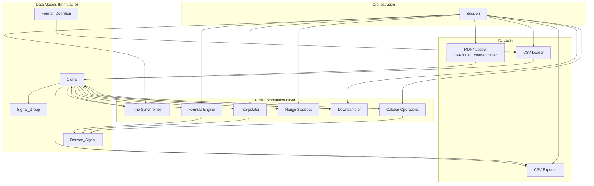
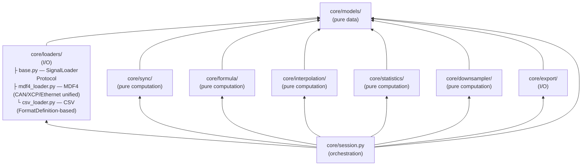
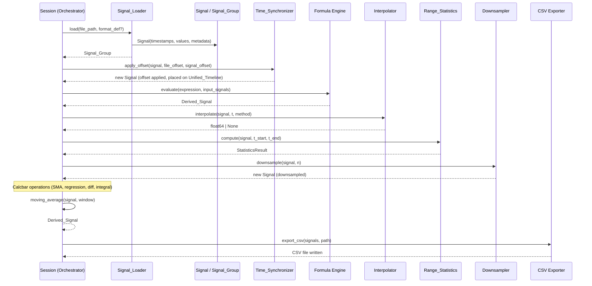
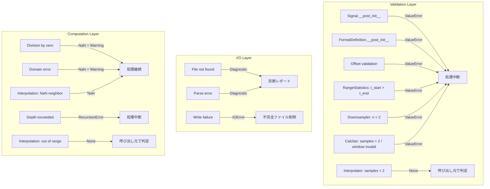

# Design Document: valisync-core

## Overview

ValiSync Core は ADAS ソフトウェア開発向けの時系列信号データ処理ライブラリである。MDF4（CAN・XCP・Ethernet を統合格納）および CSV の 2 フォーマットから信号データを読み込み、統一時間軸上で同期し、数式エンジンによる派生信号生成と CSV エクスポートを提供する。さらに、補間計算・範囲統計・ダウンサンプリング・Calcbar 演算（移動平均・回帰・微分・積分）により、GUI 層が必要とする解析機能をコアレベルで実現する。

本設計は GUI 層から完全に独立したコアロジックを対象とし、以下の設計原則に基づく:

- **不変性（Immutability）**: Signal データは生成後に変更不可。全変換処理は新しいオブジェクトを返す
- **疎結合（Loose Coupling）**: `typing.Protocol` によるインターフェース定義で各モジュールを分離
- **Strategy パターン**: フォーマット別パーサーを差し替え可能な設計
- **純粋計算の分離**: I/O 層（loaders, export）と純粋計算層（sync, formula, interpolation, statistics, downsampler）を明確に分離
- **MDF4 統合ローダー**: `asammdf` ライブラリを使用し、CAN・XCP・Ethernet を単一ローダーで一括処理。チャンネルグループのメタデータからプロトコル種別を自動判定

### システム全体像



## Architecture

### モジュール構成と依存関係



### 設計判断

| 判断事項 | 選択 | 理由 |
|---------|------|------|
| データモデル表現 | `frozen dataclass` + `numpy.ndarray` | 不変性保証 + 高速数値演算 |
| インターフェース定義 | `typing.Protocol` | 構造的部分型で疎結合を実現 |
| パーサー切り替え | Strategy パターン | フォーマット追加時に既存コード変更不要 |
| MDF4 読み込みライブラリ | `asammdf` | ASAM 標準準拠・チャンネルグループメタデータからプロトコル種別を自動判定可能・活発にメンテナンスされている |
| asammdf 読み込みオプション | `time_from_zero=False`, `ignore_value2text_conversions=True` | `time_from_zero=False`: 元データのタイムスタンプを改ざんせず生の値のまま保持（データ整合性）。`ignore_value2text_conversions=True`: 値を float64 数値型で取得しメモリ消費量を削減、プロット時の数値処理を簡素化。テキスト変換テーブルは Signal の metadata フィールドに別途保持する |
| 時系列データ型 | `numpy.float64` | IEEE 754 倍精度で有効桁 15〜17 桁を保証 |
| Format_Definition 永続化 | JSON ファイル（`data/` ディレクトリ） | 人間可読・バージョン管理可能 |
| Formula パーサー | 再帰下降パーサー（自前実装） | 外部依存なし・入れ子深度制御が容易 |
| numpy 配列の不変性 | `ndarray.flags.writeable = False` | frozen dataclass だけでは配列内容の変更を防げないため |
| 補間モジュール配置 | `interpolation/` 独立モジュール | sync/ に含めると責務過多。GUI カーソル値読み取りに特化した純粋計算 |
| 統計モジュール配置 | `statistics/` 独立モジュール | 範囲統計は同期・Formula とは独立した解析機能 |
| ダウンサンプラー配置 | `downsampler/` 独立モジュール | 描画最適化に特化。LOD レンダリングの前処理として独立性が高い |
| Calcbar 演算配置 | `session.py` 内メソッド | 移動平均・回帰・微分・積分は Session が提供する高レベル演算。個別モジュール化するほど複雑ではない |
| 補間結果の型表現 | `float | None` (Union type) | 範囲外・補間不可を `None` で表現し、型レベルで正常値と区別 |
| 統計結果の型表現 | `frozen dataclass` | 複数の統計値をまとめて返す構造化データ |
| MDF4 ローダー統合 | 単一 `Mdf4Loader` で CAN/XCP/Ethernet を一括処理 | MDF4 は複数プロトコルを単一ファイルに格納する設計。チャンネルグループ単位でメタデータからバス種別をタグ付けすれば個別ローダーは不要 |
| Signal の由来フィールド分割 | `file_format`（MDF4/CSV/Derived）+ `bus_type`（CAN/XCP/Ethernet/""）の2フィールド | 1フィールドでは「ファイルコンテナ形式」「通信方式」「派生信号」の3次元を混在させてしまい、Phase 3 永続化でのローダー選択や GUI でのプロトコル別グルーピングが推論に依存する。分割することでそれぞれの次元が独立して利用できる |

### データフロー



## Components and Interfaces

### Signal_Loader Protocol

```python
from typing import Protocol
from pathlib import Path

class SignalLoader(Protocol):
    """フォーマット別信号読み込みインターフェース"""

    def load(self, file_path: Path) -> "LoadResult":
        """ファイルを読み込み Signal_Group を返す。エラー時は診断情報を含む。"""
        ...

    def supports(self, file_path: Path) -> bool:
        """このローダーが対象ファイルを処理可能か判定する。"""
        ...
```

### MDF4 Loader（CAN/XCP/Ethernet 統合）

```python
class Mdf4Loader:
    """MDF4 ファイル読み込み。asammdf を使用して全チャンネルグループを一括解析する。

    asammdf 読み込みオプション:
    - time_from_zero=False: タイムスタンプを元ファイルの生の値のまま保持（ゼロ基準化しない）
    - ignore_value2text_conversions=True: 値を float64 数値型で取得（テキスト変換を適用しない）
      → メモリ消費量削減・プロット時の数値処理を簡素化
      → 値→テキスト変換テーブルは Signal.metadata に別途保持

    各チャンネルグループのメタデータからバス種別（CAN, XCP, Ethernet）を判定し、
    各 Signal の bus_type フィールドに記録する。file_format は常に "MDF4"。
    また、asammdf から取得可能な信号プロパティ（単位、コメント、サンプリングレート、
    チャンネルグループ名、物理値/RAW値変換情報、値→テキスト変換テーブル）
    を Signal.metadata に格納する。
    """

    # asammdf 読み込み時の固定オプション
    _READ_OPTIONS = {
        "time_from_zero": False,
        "ignore_value2text_conversions": True,
    }

    def load(self, file_path: Path) -> "LoadResult":
        ...

    def supports(self, file_path: Path) -> bool:
        """拡張子 .mf4 のファイルを処理可能と判定する。"""
        ...

    def _extract_metadata(self, channel) -> dict[str, Any]:
        """asammdf チャンネルから Signal メタデータを抽出する。

        抽出項目:
        - unit: 単位
        - comment: コメント
        - sampling_rate: サンプリングレート
        - channel_group_name: チャンネルグループ名
        - source_bus_type: ソースバス種別
        - conversion_info: 物理値/RAW値変換情報
        - value_to_text_table: 値→テキスト変換テーブル
        """
        ...
```

### CSV Loader（Format_Definition 依存）

```python
class CsvLoader:
    """CSV ファイル読み込み。Format_Definition に基づきパースする。"""

    def load(self, file_path: Path, format_def: "FormatDefinition") -> "LoadResult":
        ...
```

### Signal_Group Manager

```python
class SignalGroupManager:
    """読み込み済み Signal_Group をファイル単位のキーで管理する。

    各 Signal_Group に file_format から導出したキー（mf4_<n> / csv_<n>、
    フォーマット別連番）を割り当て、全 Signal 名を `{key}::{原信号名}` の名前空間に
    展開する。これにより異なるファイル間（同一パスの重複読み込みを含む）で同名信号が
    衝突しない。連番はファイル削除後も再利用せず、キーは安定識別子として機能する。

    設計判断:
    - 重複読み込み許可（Req 4.7）: 削除は key 指定で行う（パスは重複しうるため曖昧）
    - 表示名（原信号名・ソースファイル）の復元は GUI 層の責務。原信号名は
      `name.split("::", 1)` で復元可能（key に `::` を含まないため堅牢）
    - 依存チェック（Req 4.5）と一括読み込みの部分失敗処理（Req 5.4）は I/O を伴う
      オーケストレーションであり Session（core/session.py）が担う。本マネージャは
      add/remove のみを提供する
    - Phase 1 では signals() が呼び出しごとに keyed Signal を再生成する。
      大規模信号での再検証コスト最適化は Phase 2 へ繰り延べる
    """

    def add(self, group: "SignalGroup") -> str:
        """Signal_Group を登録し、割り当てたキーを返す。"""
        ...

    def remove(self, key: str) -> "SignalGroup":
        """キー指定で Signal_Group を削除し、削除した group を返す。"""
        ...

    def signals(self) -> list["Signal"]:
        """全 Signal_Group の信号を、キーで名前空間化して返す。"""
        ...
```

### Time_Synchronizer

```python
class TimeSynchronizer:
    """時刻同期モジュール。純粋計算のみ、I/O なし。

    Unified_Timeline はオフセット加算により創発する性質であり、コレクション全体を
    変換する処理は存在しない。各 Signal への apply_offset() 適用が同期処理の実体で
    あり、コレクションレベルのオーケストレーション（全 Signal への適用）は Session が担う。
    """

    def apply_offset(
        self,
        signal: "Signal",
        file_offset: float = 0.0,
        signal_offset: float = 0.0,
    ) -> "Signal":
        """オフセットを適用した新しい Signal を返す。元の Signal は変更しない。"""
        ...
```

### Formula Engine

```python
class FormulaEngine:
    """数式エンジン。入力 Signal から Derived_Signal を生成する。"""

    def evaluate(
        self,
        expression: str,
        signals: dict[str, "Signal"],
        max_depth: int = 100,
    ) -> "Signal":
        """式を評価し Derived_Signal を返す。構文エラー時は例外を送出。"""
        ...

    def validate(self, expression: str) -> "ValidationResult":
        """式の構文を検証する。実行はしない。"""
        ...
```

### CSV Exporter

```python
class CsvExporter:
    """CSV エクスポート。Signal データを CSV ファイルとして出力する。"""

    def export(
        self,
        signals: list["Signal"],
        output_path: Path,
        use_unified_timeline: bool = False,
    ) -> None:
        """Signal を CSV ファイルとして出力する。失敗時は不完全ファイルを残さない。"""
        ...
```

### Format_Definition Manager

```python
class FormatDefinitionManager:
    """Format_Definition の CRUD 操作と JSON 永続化を管理する。"""

    def save(self, format_def: "FormatDefinition") -> None:
        """Format_Definition を JSON ファイルとして保存する。"""
        ...

    def load_all(self) -> list["FormatDefinition"]:
        """保存済みの全 Format_Definition を読み込む。"""
        ...

    def delete(self, name: str) -> None:
        """指定名の Format_Definition を削除する。"""
        ...
```

### Interpolator

```python
from enum import Enum

class InterpolationMethod(Enum):
    LINEAR = "linear"
    ZERO_ORDER_HOLD = "zero_order_hold"
    NEAREST = "nearest"

class Interpolator:
    """補間計算モジュール。純粋計算のみ、I/O なし。元の Signal を変更しない。"""

    def interpolate(
        self,
        signal: "Signal",
        t: float,
        method: InterpolationMethod = InterpolationMethod.LINEAR,
    ) -> float | None:
        """指定時刻 t における補間値を返す。

        Returns:
            float: 補間成功時の値（float64 精度）
            None: 範囲外またはサンプル数不足で補間不可の場合

        Notes:
            - Signal のサンプル数が 2 未満の場合は None を返す
            - t が Signal のタイムスタンプ範囲外の場合は None を返す
            - t が既存タイムスタンプと完全一致する場合はそのサンプル値を返す
            - 隣接 2 点のいずれかが NaN の場合は NaN を返す
        """
        ...
```

### Range_Statistics

```python
from dataclasses import dataclass

@dataclass(frozen=True)
class StatisticsResult:
    """範囲統計計算結果。"""
    mean: float    # 平均値（サンプル 0 個の場合は NaN）
    max: float     # 最大値（サンプル 0 個の場合は NaN）
    min: float     # 最小値（サンプル 0 個の場合は NaN）
    std: float     # 標準偏差 ddof=0（サンプル 0 個の場合は NaN）
    count: int     # サンプル数

class RangeStatistics:
    """範囲統計計算モジュール。純粋計算のみ、I/O なし。元の Signal を変更しない。"""

    def compute(
        self,
        signal: "Signal",
        t_start: float,
        t_end: float,
    ) -> "StatisticsResult":
        """指定時間範囲内のサンプルに対して統計値を計算する。

        Args:
            signal: 対象 Signal
            t_start: 開始時刻（inclusive）
            t_end: 終了時刻（inclusive）

        Returns:
            StatisticsResult: 統計計算結果

        Raises:
            ValueError: t_start > t_end、または NaN/Inf が指定された場合
        """
        ...
```

### Downsampler

```python
class Downsampler:
    """ダウンサンプリングモジュール。純粋計算のみ、I/O なし。元の Signal を変更しない。"""

    def downsample(
        self,
        signal: "Signal",
        n: int,
    ) -> "Signal":
        """min-max ダウンサンプリングにより Signal を n ポイント以下に間引く。

        Args:
            signal: 対象 Signal
            n: 目標ポイント数（2 以上の整数）

        Returns:
            Signal: ダウンサンプリング結果。サンプル数 <= n の場合は元の Signal をそのまま返す。

        Raises:
            ValueError: n が 2 未満、非整数、NaN、または無限大の場合

        Notes:
            - min-max アルゴリズム: Signal を均等区間に分割し、各区間の min/max を保持
            - 結果のタイムスタンプは元の Signal の範囲内に収まる
            - 結果のタイムスタンプは厳密に単調増加
        """
        ...
```

### Calcbar Operations（Session メソッド）

```python
class Session:
    """解析セッション。Calcbar 演算メソッドを含む。"""

    def moving_average(
        self,
        signal: "Signal",
        window: int,
    ) -> "Signal":
        """単純移動平均（SMA）を計算する。

        Args:
            signal: 対象 Signal（要素数 2 以上）
            window: ウィンドウサイズ（1 以上かつ Signal の要素数以下）

        Returns:
            Derived_Signal: 各サンプルの SMA 値。先頭 w-1 サンプルは縮小ウィンドウ方式。

        Raises:
            ValueError: Signal の要素数が 2 未満、または window が範囲外の場合
        """
        ...

    def linear_regression(
        self,
        signal: "Signal",
    ) -> "Signal":
        """線形回帰（最小二乗法）を計算する。

        Args:
            signal: 対象 Signal（要素数 2 以上）

        Returns:
            Derived_Signal: 入力と同一タイムスタンプ列に対する回帰直線上の予測値。

        Raises:
            ValueError: Signal の要素数が 2 未満の場合
        """
        ...

    def differentiate(
        self,
        signal: "Signal",
    ) -> "Signal":
        """数値微分（中心差分、端点は前方/後方差分）を計算する。

        Args:
            signal: 対象 Signal（要素数 2 以上）

        Returns:
            Derived_Signal: 各サンプルの微分値。要素数は入力と一致。

        Raises:
            ValueError: Signal の要素数が 2 未満の場合
        """
        ...

    def integrate(
        self,
        signal: "Signal",
    ) -> "Signal":
        """累積数値積分（台形則）を計算する。

        Args:
            signal: 対象 Signal（要素数 2 以上）

        Returns:
            Derived_Signal: 先頭 0.0 から始まる累積積分値。要素数は入力と一致。

        Raises:
            ValueError: Signal の要素数が 2 未満の場合
        """
        ...
```

## Data Models

### Signal

```python
import numpy as np
from dataclasses import dataclass, field
from typing import Any

@dataclass(frozen=True)
class Signal:
    """時系列信号データ。生成後は不変。

    Invariants:
    - len(timestamps) == len(values)
    - timestamps は厳密に単調増加（空の場合を除く）
    - timestamps の全要素は有限値（NaN, Inf を含まない）
    - timestamps.flags.writeable == False
    - values.flags.writeable == False
    """
    name: str
    timestamps: np.ndarray  # dtype=float64, shape=(n,)
    values: np.ndarray      # dtype=float64, shape=(n,)
    file_format: str        # "MDF4" | "CSV" | "Derived"  ← コンテナ形式（ローダー選択・永続化の根拠）
    bus_type: str           # "CAN" | "XCP" | "Ethernet" | ""  ← MDF4内バス種別（CSV/Derived は空文字列）
    source_file: str        # 元ファイルの絶対パス（Derived の場合は空文字列）
    metadata: dict[str, Any] = field(default_factory=dict)
    # MDF4 読み込み時に格納される信号プロパティ:
    #   - unit: str — 単位
    #   - comment: str — コメント
    #   - sampling_rate: float — サンプリングレート
    #   - channel_group_name: str — チャンネルグループ名
    #   - conversion_info: dict — 物理値/RAW値変換情報
    #   - value_to_text_table: dict — 値→テキスト変換テーブル
    # CSV 読み込み時および Derived_Signal では空辞書

    def __post_init__(self) -> None:
        """不変条件を検証し、numpy 配列を書き込み不可に設定する。"""
        # 要素数一致チェック
        if len(self.timestamps) != len(self.values):
            raise ValueError(
                f"timestamps ({len(self.timestamps)}) and values ({len(self.values)}) "
                f"must have the same length"
            )
        # 空でない場合の検証
        if len(self.timestamps) > 0:
            # 有限値チェック
            if not np.all(np.isfinite(self.timestamps)):
                idx = int(np.argmax(~np.isfinite(self.timestamps)))
                raise ValueError(
                    f"timestamps contains non-finite value at index {idx}"
                )
            # 単調増加チェック
            if not np.all(np.diff(self.timestamps) > 0):
                diffs = np.diff(self.timestamps)
                idx = int(np.argmax(diffs <= 0)) + 1
                raise ValueError(
                    f"timestamps not strictly monotonically increasing at index {idx}"
                )
        # 書き込み不可に設定
        object.__setattr__(self, 'timestamps',
                          self.timestamps.copy() if self.timestamps.flags.writeable
                          else self.timestamps)
        object.__setattr__(self, 'values',
                          self.values.copy() if self.values.flags.writeable
                          else self.values)
        self.timestamps.flags.writeable = False
        self.values.flags.writeable = False
```

### Signal_Group

```python
from dataclasses import dataclass
from datetime import datetime
from pathlib import Path

@dataclass(frozen=True)
class SignalGroup:
    """ファイル単位の Signal 集合。

    Invariants:
    - signals リスト内の全 Signal は同一の source_file を持つ
    - source_path は絶対パス
    """
    signals: tuple[Signal, ...]  # immutable tuple
    source_path: Path            # ソースファイルの絶対パス（絶対パス必須）
    file_format: str             # "MDF4" | "CSV"（バス種別は各 Signal.bus_type を参照）
    loaded_at: datetime          # 読み込み日時（秒精度）
```

### Format_Definition

```python
from dataclasses import dataclass
from enum import Enum

class Delimiter(Enum):
    COMMA = ","
    TAB = "\t"
    SEMICOLON = ";"
    SPACE = " "

@dataclass(frozen=True)
class FormatDefinition:
    """CSV フォーマット定義。

    Invariants:
    - 1 <= len(name) <= 64
    - 0 <= timestamp_column <= 255
    - 0 <= signal_start_column <= signal_end_column <= 255
    - timestamp_column が signal_start_column..signal_end_column の範囲外
    - timestamp_unit は "sec" または "msec"
    """
    name: str                    # 定義名（1〜64 文字、一意）
    delimiter: Delimiter         # 区切り文字
    timestamp_column: int        # タイムスタンプ列インデックス（0始まり）
    timestamp_unit: str          # タイムスタンプの単位（"sec" | "msec"）。数値として直接パースする
    signal_start_column: int     # 信号データ開始列
    signal_end_column: int       # 信号データ終了列
    has_header: bool             # ヘッダー行の有無
    has_unit_row: bool           # 単位行の有無（ヘッダー行直後に各列の単位を記載した行）

    def __post_init__(self) -> None:
        """バリデーション"""
        if not (1 <= len(self.name) <= 64):
            raise ValueError("name must be 1-64 characters")
        if not (0 <= self.timestamp_column <= 255):
            raise ValueError("timestamp_column must be 0-255")
        if not (0 <= self.signal_start_column <= self.signal_end_column <= 255):
            raise ValueError("signal columns must be 0-255 and start <= end")
        if self.signal_start_column <= self.timestamp_column <= self.signal_end_column:
            raise ValueError("timestamp_column must not overlap signal columns")
```

### LoadResult

```python
from dataclasses import dataclass

@dataclass(frozen=True)
class LoadResult:
    """読み込み結果。成功時は signal_group を、失敗時は diagnostics を含む。"""
    signal_group: SignalGroup | None
    diagnostics: tuple[Diagnostic, ...] = ()

@dataclass(frozen=True)
class Diagnostic:
    """診断メッセージ"""
    level: str       # "error" | "warning"
    message: str
    line_number: int | None = None
    column_number: int | None = None
    signal_name: str | None = None
    sample_index: int | None = None
```

### FormatDefinition JSON スキーマ

永続化時の JSON 構造:

```json
{
  "name": "example_format",
  "delimiter": ",",
  "timestamp_column": 0,
  "timestamp_unit": "sec",
  "signal_start_column": 1,
  "signal_end_column": 5,
  "has_header": true,
  "has_unit_row": false
}
```

### InterpolationMethod

```python
from enum import Enum

class InterpolationMethod(Enum):
    """補間方式の列挙型。"""
    LINEAR = "linear"              # 線形補間
    ZERO_ORDER_HOLD = "zero_order_hold"  # 前値保持（ゼロ次ホールド）
    NEAREST = "nearest"            # 最近傍
```

### StatisticsResult

```python
import math
from dataclasses import dataclass

@dataclass(frozen=True)
class StatisticsResult:
    """範囲統計計算結果。不変データモデル。

    Invariants:
    - count >= 0
    - count == 0 の場合、mean/max/min/std は全て NaN
    - count > 0 の場合、min <= mean <= max
    - std >= 0（count > 0 の場合）
    """
    mean: float    # 平均値（float64）
    max: float     # 最大値（float64）
    min: float     # 最小値（float64）
    std: float     # 標準偏差 ddof=0（float64）
    count: int     # 範囲内サンプル数

    @staticmethod
    def empty() -> "StatisticsResult":
        """空範囲用のファクトリメソッド。全統計値を NaN で初期化する。"""
        return StatisticsResult(
            mean=math.nan, max=math.nan, min=math.nan, std=math.nan, count=0
        )
```


## Correctness Properties

*プロパティとは、システムの全ての有効な実行において真であるべき特性または振る舞いである。人間が読める仕様と機械的に検証可能な正しさの保証を橋渡しする形式的な記述である。*

### Property 1: Signal データモデル不変条件

*任意の* float64 配列ペア (timestamps, values) に対して、Signal の生成は以下の場合にのみ成功する: (a) 両配列の要素数が一致し、(b) timestamps の全要素が有限値であり、(c) timestamps が厳密に単調増加である。これらの条件を満たさない入力は必ずバリデーションエラーを送出する。

**Validates: Requirements 11.1, 11.2, 11.4, 11.5, 11.6**

### Property 2: Signal の不変性（Immutability）

*任意の* 有効な Signal に対して、生成後に timestamps 配列または values 配列の要素を変更しようとする操作は、必ず例外を発生させ、配列の内容は変更されない。

**Validates: Requirements 6.2, 6.3**

### Property 3: 変換処理の入力不変性

*任意の* 有効な Signal と任意の変換操作（オフセット適用、同期処理、Formula 評価、補間計算、範囲統計計算、ダウンサンプリング、Calcbar 演算）に対して、変換処理の実行後も入力 Signal の timestamps と values は変換前と完全に一致する。

**Validates: Requirements 6.4, 10.8, 12.9, 13.7, 14.5, 15.6**

### Property 4: FormatDefinition バリデーション

*任意の* FormatDefinition の設定値に対して、(a) name が 1〜64 文字、(b) timestamp_column が 0〜255、(c) signal_start_column ≤ signal_end_column かつ各 0〜255、(d) timestamp_column が signal 列範囲と重複しない場合にのみ生成が成功し、これらの条件を満たさない入力は必ずバリデーションエラーを送出する。

**Validates: Requirements 3.2, 3.6**

### Property 5: FormatDefinition JSON ラウンドトリップ

*任意の* 有効な FormatDefinition に対して、JSON ファイルへの保存後に再読み込みした結果は、元の FormatDefinition と全フィールドが一致する。

**Validates: Requirements 3.3, 3.5**

### Property 6: MDF4 Signal ラウンドトリップ

*任意の* 有効な MDF4 Signal データ（CAN・XCP・Ethernet いずれのプロトコル種別でも）に対して、内部表現から再出力し再度パースした結果は、元の Signal と全タイムスタンプおよび全信号値が一致する。

**Validates: Requirements 1.5**

### Property 7: CSV 読み込みラウンドトリップ

*任意の* 有効な float64 値を含む CSV データと対応する FormatDefinition に対して、読み込み後に同一フォーマットで再出力し再度読み込んだ結果は、元の数値と IEEE 754 倍精度の有効桁 15 桁以内で一致する。

**Validates: Requirements 2.7**

### Property 8: CSV エクスポートラウンドトリップ

*任意の* 有効な Signal に対して、CSV エクスポート後に再度読み込んだ結果は、元の Signal のタイムスタンプおよび値の各要素が IEEE 754 倍精度の有効桁 17 桁以内で一致する。

**Validates: Requirements 7.6**

### Property 9: 同名信号の一意性保証

*任意の* ファイルと信号名の組み合わせにおいて、各 Signal 名にファイル単位のキー（`mf4_1` 等）を `::` 区切りで接頭辞付与した結果、SignalGroupManager が管理する全信号名は一意である（同一パスを重複読み込みした場合を含む）。

**Validates: Requirements 4.6, 4.7**

### Property 10: オフセット加算の正確性

*任意の* 有効な Signal と任意の有限 float64 オフセット値（ファイル単位 + 信号単位）に対して、オフセット適用後の各タイムスタンプは元のタイムスタンプに両オフセットの合計を加算した値と等しい。

**Validates: Requirements 9.1, 9.2, 9.3, 9.5**

### Property 11: オフセット適用後の間隔保存

*任意の* 有効な Signal と任意の有限 float64 オフセット値に対して、オフセット適用後の連続サンプル間の時間差（diff(timestamps)）は、適用前の時間差と浮動小数点演算の丸め誤差以内で一致する。

**Validates: Requirements 9.4**

### Property 12: オフセット適用後のサンプル数不変

*任意の* 有効な Signal と任意の有限 float64 オフセットに対して、`apply_offset()` 適用後の Signal のサンプル数は適用前と一致する（同期は各 Signal への apply_offset() 適用として実現され、Unified_Timeline 配置はリサンプリングを伴わない）。

**Validates: Requirements 8.4**

### Property 13: オフセット適用後の単調性保存

*任意の* 有効な Signal と任意の有限 float64 オフセットに対して、`apply_offset()` 適用後も各 Signal 内のタイムスタンプ列は厳密に単調増加を維持する。

**Validates: Requirements 8.6**

### Property 14: Unified_Timeline 配置における相対順序保存

*任意の* 2 つの Signal A, B を Session が Unified_Timeline 上に配置する（各 Signal に apply_offset() を適用するのみで、並べ替え・リサンプリングを行わない）とき、配置後のサンプル a_i, b_j の時間的順序は両者のオフセット適用後タイムスタンプ（a_i.timestamp + offset_A, b_j.timestamp + offset_B）の大小と一致する。すなわち Unified_Timeline 配置は順序を変える操作を含まない。

**Validates: Requirements 8.3**

### Property 15: 共通区間演算の正確性

*任意の* 複数の有効な Signal を入力とする Formula 演算に対して、結果の Derived_Signal のタイムスタンプは全入力 Signal のタイムスタンプ列の共通区間（時間範囲の積集合）内に収まる。

**Validates: Requirements 10.3**

### Property 16: Derived_Signal のデータモデル準拠

*任意の* 有効な Formula と有効な入力 Signal に対して、生成された Derived_Signal は Signal の全不変条件（タイムスタンプの有限値・単調増加、要素数一致）を満たす。また、Calcbar 演算（移動平均・線形回帰・微分・積分）の結果も同様に Signal の全不変条件を満たす。

**Validates: Requirements 10.5, 10.6, 15.5**

### Property 17: 補間計算の正確性

*任意の* サンプル数 2 以上の有効な Signal と、Signal のタイムスタンプ範囲内の任意の時刻 t に対して、各補間方式は以下の数学的定義に従った値を返す: (a) 線形補間: t を挟む隣接 2 点 (t[i], v[i]) と (t[i+1], v[i+1]) から v[i] + (v[i+1] - v[i]) * (t - t[i]) / (t[i+1] - t[i]) を計算、(b) 前値保持: t 以下で最大のタイムスタンプに対応する値を返す、(c) 最近傍: t に最も近いタイムスタンプに対応する値を返す。

**Validates: Requirements 12.1, 12.3, 12.4, 12.5**

### Property 18: 補間の完全一致タイムスタンプ

*任意の* サンプル数 2 以上の有効な Signal と、Signal のタイムスタンプ列に含まれる任意の時刻 t に対して、全ての補間方式は補間計算を行わず、該当サンプルの値をそのまま返す。

**Validates: Requirements 12.8**

### Property 19: 補間の範囲外拒否

*任意の* サンプル数 2 以上の有効な Signal と、Signal のタイムスタンプ範囲（min(timestamps)〜max(timestamps)）外の任意の時刻 t に対して、全ての補間方式は範囲外を示す結果（None）を返し、外挿計算を行わない。

**Validates: Requirements 12.7**

### Property 20: 範囲統計の正確性

*任意の* 有効な Signal と有効な時間範囲（t_start ≤ t_end、両方有限値）に対して、Range_Statistics が返す統計値は、t_start ≤ timestamp ≤ t_end を満たすサンプルの values に対する numpy.mean、numpy.max、numpy.min、numpy.std(ddof=0) の結果と一致し、count はそのサンプル数と一致する。

**Validates: Requirements 13.1, 13.2, 13.3, 13.8**

### Property 21: ダウンサンプリング出力の不変条件

*任意の* 有効な Signal と 2 以上の整数 n に対して、ダウンサンプリング結果は以下を全て満たす: (a) 出力サンプル数 ≤ n、(b) 出力タイムスタンプは元の Signal のタイムスタンプ範囲内に収まる、(c) 出力タイムスタンプは厳密に単調増加である。

**Validates: Requirements 14.1, 14.3, 14.6**

### Property 22: ダウンサンプリングのパススルー

*任意の* 有効な Signal と、Signal のサンプル数以上の整数 n に対して、ダウンサンプリング結果は元の Signal と同一（タイムスタンプ列・値列が完全一致）である。

**Validates: Requirements 14.4**

### Property 23: 移動平均の正確性

*任意の* サンプル数 2 以上の有効な Signal と有効なウィンドウサイズ w（1 ≤ w ≤ len(signal)）に対して、移動平均結果の各サンプル i の値は、values[max(0, i-w+1):i+1] の算術平均と一致する。

**Validates: Requirements 15.1**

### Property 24: 線形回帰の最小二乗特性

*任意の* サンプル数 2 以上の有効な Signal に対して、線形回帰結果は以下を満たす: (a) 出力タイムスタンプは入力と同一、(b) 出力値は一次関数 y = a*t + b の形式であり、残差の二乗和が最小となる a, b を使用する（numpy.polyfit(degree=1) と同等の結果）。

**Validates: Requirements 15.2**

### Property 25: 数値微分の正確性

*任意の* サンプル数 2 以上の有効な Signal に対して、数値微分結果の各サンプル i の値は以下に従う: (a) 内部点（0 < i < n-1）: (values[i+1] - values[i-1]) / (timestamps[i+1] - timestamps[i-1])（中心差分）、(b) 先頭（i=0）: (values[1] - values[0]) / (timestamps[1] - timestamps[0])（前方差分）、(c) 末尾（i=n-1）: (values[n-1] - values[n-2]) / (timestamps[n-1] - timestamps[n-2])（後方差分）。出力要素数は入力と一致する。

**Validates: Requirements 15.3**

### Property 26: 数値積分の正確性

*任意の* サンプル数 2 以上の有効な Signal に対して、累積数値積分結果は以下を満たす: (a) 先頭サンプルの値は 0.0、(b) 各サンプル i（i ≥ 1）の値は台形則による累積和 Σ_{k=1}^{i} [(values[k-1] + values[k]) / 2 * (timestamps[k] - timestamps[k-1])] と一致する。出力要素数は入力と一致する。

**Validates: Requirements 15.4**

## Error Handling

### エラー分類

| カテゴリ | 例 | 処理方針 |
|---------|---|---------|
| バリデーションエラー | Signal 不変条件違反、FormatDefinition 不正値、補間サンプル数不足、統計範囲不正、ダウンサンプリング n 不正、ウィンドウサイズ不正 | 即座に例外送出。処理を中断 |
| ファイル I/O エラー | ファイル不存在、読み取り権限なし、書き込み失敗 | `LoadResult.diagnostics` にエラー情報を格納。部分的成功を許容 |
| パースエラー | MDF4 フォーマット不正、CSV 非数値データ | 行番号・列番号を含む診断メッセージ。読み込み中断 |
| 演算エラー | ゼロ除算、定義域外 | NaN として記録。警告を報告し処理継続 |
| 深度超過エラー | Formula 入れ子 100 階層超過 | 即座にエラー。処理を中断 |
| 範囲外参照 | 補間時刻が Signal 範囲外 | None を返す（例外ではなく戻り値で表現） |

### エラー伝播戦略



### Diagnostic モデル

全てのエラー・警告は `Diagnostic` データクラスで統一的に表現する:

- `level`: "error" | "warning"
- `message`: 人間可読なエラー説明
- `line_number`: ファイル内の行番号（該当する場合）
- `column_number`: 列番号（該当する場合）
- `signal_name`: 関連する信号名（該当する場合）
- `sample_index`: サンプルインデックス（該当する場合）

### エクスポート時の原子性保証

CSV エクスポートは一時ファイルへの書き込み後にリネームする方式で原子性を保証する:

1. 一時ファイル（`output_path.tmp`）に書き込み
2. 書き込み完了後に `os.replace()` で最終パスにリネーム
3. 書き込み中にエラーが発生した場合、一時ファイルを削除

## Testing Strategy

### テスト構成

| テストファイル | 対象 | テスト種別 |
|-------------|------|----------|
| `tests/test_pbt_signal.py` | Signal データモデル不変条件、不変性 | Property-based |
| `tests/test_pbt_sync.py` | 時刻同期（オフセット、サンプル数、単調性、順序） | Property-based |
| `tests/test_pbt_formula.py` | Formula エンジン（共通区間、Derived_Signal 準拠） | Property-based |
| `tests/test_pbt_csv.py` | CSV ラウンドトリップ、FormatDefinition ラウンドトリップ | Property-based |
| `tests/test_pbt_mdf4.py` | MDF4 Signal ラウンドトリップ（CAN/XCP/Ethernet 統合） | Property-based |
| `tests/test_pbt_interpolation.py` | 補間計算（正確性、完全一致、範囲外拒否） | Property-based |
| `tests/test_pbt_statistics.py` | 範囲統計（numpy 参照値との一致） | Property-based |
| `tests/test_pbt_downsampler.py` | ダウンサンプリング（出力不変条件、パススルー） | Property-based |
| `tests/test_pbt_calcbar.py` | Calcbar 演算（移動平均、回帰、微分、積分の正確性） | Property-based |
| `tests/test_loaders.py` | ローダーのユニットテスト（エラーケース、エッジケース） | Unit |
| `tests/test_export.py` | エクスポートのユニットテスト（フォーマット、エラー処理） | Unit |
| `tests/test_session.py` | セッション管理（Signal_Group 操作、依存関係） | Unit |
| `tests/test_format_def.py` | FormatDefinition CRUD、バリデーション | Unit |
| `tests/test_interpolation.py` | 補間のユニットテスト（NaN 伝播、サンプル数不足、エッジケース） | Unit |
| `tests/test_statistics.py` | 統計のユニットテスト（空範囲、バリデーションエラー） | Unit |
| `tests/test_downsampler.py` | ダウンサンプラーのユニットテスト（バリデーション、境界値） | Unit |
| `tests/test_calcbar.py` | Calcbar のユニットテスト（最小サンプル数、ウィンドウサイズ検証） | Unit |

### Property-Based Testing 設定

- **ライブラリ**: Hypothesis >= 6.100
- **最小イテレーション数**: 100 回/プロパティ
- **タグフォーマット**: `Feature: valisync-core, Property {number}: {property_text}`
- **pytest マーカー**: `@pytest.mark.property`

### Hypothesis Strategy 設計

```python
# conftest.py に定義する共有 Strategy

from hypothesis import strategies as st
import numpy as np

# 有限な float64 値
finite_floats = st.floats(
    min_value=-1e15, max_value=1e15,
    allow_nan=False, allow_infinity=False,
)

# 厳密に単調増加するタイムスタンプ配列
@st.composite
def monotonic_timestamps(draw, min_size=0, max_size=1000):
    n = draw(st.integers(min_value=min_size, max_value=max_size))
    if n == 0:
        return np.array([], dtype=np.float64)
    start = draw(finite_floats)
    diffs = draw(st.lists(
        st.floats(min_value=1e-10, max_value=1e6,
                  allow_nan=False, allow_infinity=False),
        min_size=n - 1, max_size=n - 1,
    ))
    timestamps = np.concatenate([[start], np.array(diffs)])
    return np.cumsum(timestamps)

# 有効な Signal
@st.composite
def valid_signals(draw, min_size=0, max_size=1000):
    ts = draw(monotonic_timestamps(min_size=min_size, max_size=max_size))
    values = draw(st.lists(
        finite_floats, min_size=len(ts), max_size=len(ts)
    ).map(lambda v: np.array(v, dtype=np.float64)))
    name = draw(st.text(min_size=1, max_size=50,
                        alphabet=st.characters(whitelist_categories=('L', 'N', 'P'))))
    return Signal(
        name=name, timestamps=ts, values=values,
        source_format="CAN", source_file="/test/file.log"
    )

# 補間テスト用: サンプル数 2 以上の Signal
@st.composite
def interpolatable_signals(draw, min_size=2, max_size=1000):
    """補間可能な Signal（サンプル数 2 以上）を生成する。"""
    return draw(valid_signals(min_size=min_size, max_size=max_size))

# 補間テスト用: Signal の範囲内の時刻
@st.composite
def timestamp_within_signal(draw, signal):
    """Signal のタイムスタンプ範囲内の任意の時刻を生成する。"""
    t_min = signal.timestamps[0]
    t_max = signal.timestamps[-1]
    return draw(st.floats(min_value=t_min, max_value=t_max,
                          allow_nan=False, allow_infinity=False))

# 補間方式
interpolation_methods = st.sampled_from(list(InterpolationMethod))

# 統計テスト用: 有効な時間範囲
@st.composite
def valid_time_range(draw, signal):
    """Signal のタイムスタンプ範囲に基づく有効な時間範囲を生成する。"""
    t_min = signal.timestamps[0]
    t_max = signal.timestamps[-1]
    t_start = draw(st.floats(min_value=t_min, max_value=t_max,
                             allow_nan=False, allow_infinity=False))
    t_end = draw(st.floats(min_value=t_start, max_value=t_max,
                           allow_nan=False, allow_infinity=False))
    return t_start, t_end

# ダウンサンプリングテスト用: 有効な目標ポイント数
@st.composite
def valid_target_points(draw, min_val=2, max_val=500):
    """有効な目標ポイント数を生成する。"""
    return draw(st.integers(min_value=min_val, max_value=max_val))

# Calcbar テスト用: 有効なウィンドウサイズ
@st.composite
def valid_window_size(draw, signal_length):
    """Signal の要素数に基づく有効なウィンドウサイズを生成する。"""
    return draw(st.integers(min_value=1, max_value=signal_length))

# 有効な FormatDefinition
@st.composite
def valid_format_definitions(draw):
    name = draw(st.text(min_size=1, max_size=64,
                        alphabet=st.characters(whitelist_categories=('L', 'N'))))
    delimiter = draw(st.sampled_from(list(Delimiter)))
    ts_col = draw(st.integers(min_value=0, max_value=255))
    # signal 列が ts_col と重複しないように生成
    start = draw(st.integers(min_value=0, max_value=254))
    end = draw(st.integers(min_value=start, max_value=255))
    # ts_col が signal 範囲外になるよう調整
    assume(not (start <= ts_col <= end))
    ...
```

### ユニットテスト方針

- **具体例テスト**: 各ローダーの正常系・異常系を代表的なテストデータで検証
- **エッジケーステスト**: 空ファイル、0 行データ、NaN/Inf オフセット、100 階層入れ子、補間時の NaN 隣接点、サンプル数 0/1 の Signal、空範囲統計
- **統合テスト**: セッション経由での読み込み→同期→Formula→エクスポートの一連フロー
- **エラーハンドリングテスト**: 各エラーパターンで適切な Diagnostic が生成されることを確認
- **補間エッジケース**: サンプル数 0/1 で None 返却、NaN 隣接点で NaN 返却、範囲外で None 返却
- **統計エッジケース**: 空範囲で NaN 返却、t_start > t_end でバリデーションエラー、NaN/Inf 範囲指定でバリデーションエラー
- **ダウンサンプラーエッジケース**: n < 2 でバリデーションエラー、非整数/NaN/Inf でバリデーションエラー
- **Calcbar エッジケース**: サンプル数 < 2 でエラー、ウィンドウサイズ範囲外でバリデーションエラー

### CI 統合

```yaml
# .github/workflows/ci.yml
- name: Run property-based tests
  run: uv run pytest -m property --hypothesis-seed=0
- name: Run unit tests
  run: uv run pytest -m "not property"
- name: Coverage check
  run: uv run pytest --cov --cov-fail-under=80
```
