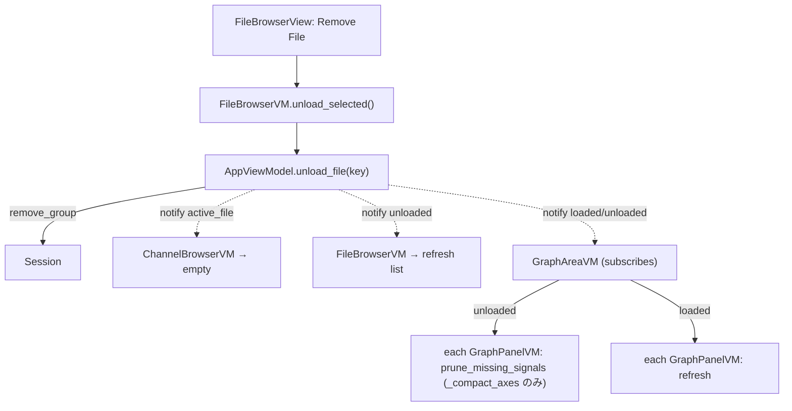

# Design Document: valisync-gui-file-browser

## Overview

The `valisync-gui-file-browser` extension refactors the primary navigation UI of ValiSync. By separating file management (Master) from channel exploration (Detail), we reduce cognitive load and improve performance when hundreds of signals are spread across multiple loaded files.

The design follows the strict MVVM architecture established in the MVP.

## Architecture

### Component Interaction

The `AppViewModel` serves as the source of truth for the application state, including the `active_file_key`. The `FileBrowserVM` writes to this state, and the `ChannelBrowserVM` reacts to it.

```mermaid
graph TD
    subgraph View (PySide6)
        MainWindow[MainWindow]
        FB_View[FileBrowserView]
        CB_View[ChannelBrowserView]
        
        MainWindow --> FB_View
        MainWindow --> CB_View
    end
    subgraph VM (Pure Python)
        AppVM[AppViewModel]
        FB_VM[FileBrowserVM]
        CB_VM[ChannelBrowserVM]
        
        FB_View -. change selection .-> FB_VM
        FB_VM -. set_active_file(key) .-> AppVM
        AppVM -. notify('active_file') .-> CB_VM
        CB_VM -. notify('signals') .-> CB_View
    end
    subgraph Model
        Session[Session]
    end

    AppVM --> Session
    FB_VM --> Session
    CB_VM --> Session
```

## ViewModels

### AppViewModel (Modified)

**State:**
- `active_file_key: str | None`: The key (e.g. `csv_1`) of the currently selected file.
- `loaded_file_keys: list[str]`: Keys for all loaded signal groups.

**Actions:**
- `set_active_file(key: str | None) -> None`: Updates the state and calls `self._notify("active_file")`.

> **Core (Session) public API — added in revision S1.** The GUI recovers display
> names and per-file signals only through Session, never its internals:
> - `Session.source_name(key) -> str`: source filename (basename) for a group key.
> - `Session.group_signals(key) -> list[Signal]`: namespaced signals of one file
>   (so a browser need not scan every loaded file).

### FileBrowserVM (New)

**Role:** Manages the list of files available for selection.

**State:**
- `files: list[str]`: Filenames (basenames) recovered via `Session.source_name(key)` for each `AppViewModel.loaded_file_keys`.

**Actions:**
- `select_file(index: int) -> None`: Translates the list index to a file key and calls `AppViewModel.set_active_file(key)`.

**Observation:**
- Subscribes to `AppViewModel` for `"loaded"` and `"unloaded"` events to refresh the file list.

### ChannelBrowserVM (Refactored)

**Role:** Provides a flat list of signals for the currently active file.

**State:**
- `signals: list[SignalItem]`: Flat list of signal objects containing `name`, `unit`, and `signal_key`.
- `filter_text: str`: Used for incremental search.

**Observation:**
- Subscribes to `AppViewModel` for `"active_file"` changes.
- When notified, it fetches the active file's signals via `Session.group_signals(active_file_key)` (no full-session scan), maps them to `SignalItem` objects, and notifies the View.
- **Unit extraction**: `unit = signal.metadata.get("unit", "")`.

## Views and Adapters

### FileBrowserView (New)

- **UI**: A `QDockWidget` containing a `QListView`.
- **Adapter**: `FileListModel` (inherits `QAbstractListModel`).
  - Implements `data()` to return filenames.
  - Connects to `FileBrowserVM` notifications to trigger `layoutChanged`.

### ChannelBrowserView (Refactored)

- **UI**: A `QDockWidget` containing a `QTreeView`.
- **Configuration**:
  - `setRootIsDecorated(False)`: Disables the tree expansion icons.
  - `setItemsExpandable(False)`: Forces a flat appearance.
- **Adapter**: `SignalTableModel` (refactored from `SignalTreeModel`).
  - Inherits `QAbstractTableModel`.
  - **Columns (2)**: 0 = "Name", 1 = "Unit".
  - Connects to `ChannelBrowserVM` notifications to refresh data.

## MainWindow Integration

**Layout Wiring:**
```python
# Initial setup in MainWindow.__init__
self.addDockWidget(Qt.RightDockWidgetArea, self.file_browser_dock)
self.addDockWidget(Qt.RightDockWidgetArea, self.channel_browser_dock)
# Stack them vertically
self.splitDockWidget(self.file_browser_dock, self.channel_browser_dock, Qt.Vertical)
```

## Unload (R7)

**Design principle — reconcile against the source of truth.** The `Session` is the
single source of truth for loaded signals; every component that caches signal
references (graph panels' plotted list, the active-file key, the file list)
**reconciles against the Session** when the loaded set changes. Unload is one such
change, not a special case — so removal is symmetric with addition and leaves no
stale state.

### Coordinator — `AppViewModel.unload_file(key)`
1. `result = self._session.remove_group(key)`. If `not result.removed` (a
   Derived_Signal depends on it — currently unreachable), return early with **no
   side effects** (R7.6).
2. Remove `key` from `_loaded_file_keys`.
3. If `active_file_key == key`: set it to `None` and `_notify("active_file")`.
4. `_notify("unloaded")`.

### Reconcilers (subscribe to `AppViewModel`)
- **FileBrowserVM** — already listens for `"loaded"`/`"unloaded"`; rebuilds the
  list from `loaded_file_keys` (the `"unloaded"` listener, previously dead, is now
  driven by this requirement). Adds `unload_selected()` → `AppViewModel.unload_file`.
- **ChannelBrowserVM** — already reacts to `"active_file"`; empties when the active
  file was cleared (R5.3). No change.
- **GraphAreaVM** — takes `app_vm` as its constructor argument (deriving `session`
  from `app_vm.session`) and **subscribes to `AppViewModel` itself**, owning panel
  reconciliation for app-level data events: on `"loaded"` it refreshes every
  panel's render cache; on `"unloaded"` it calls `prune_missing_signals()` on every
  panel. This makes it consistent with the other sub-VMs (FileBrowserVM /
  ChannelBrowserVM hold `app_vm`) and **removes panel coordination from
  `MainWindow`** — the previous `MainWindow._on_app_change → _refresh_panels` on
  `"loaded"` moves here, so load and unload are reconciled the same way by the VM
  that owns the panels. Its ~50 existing tests change `GraphAreaVM(session)` →
  `GraphAreaVM(AppViewModel(session))`.

### `GraphPanelVM` changes
- **`prune_missing_signals()`** *(new)*: drop every `_plotted` entry whose key is no
  longer in `self._session.signals()`, then reconcile axes. Keyed on the Session
  (not on the unloaded key), so it is correct regardless of *why* a signal
  disappeared. `render_data()` already skips missing signals (`sig_map.get(...)`),
  so this method cleans the lingering bookkeeping and triggers a re-render.
- **Axis reconciliation on removal**: `remove_signal()` and `prune_missing_signals()`
  call `_compact_axes()` after removing (no relayout), so the emptied axis is pruned
  while the survivors keep their absolute heights/positions and the removed band is
  left blank (R7.4). `create_new_axis` instead compacts + equal-splits. This
  **resolves the previously-deferred empty-region-after-removal follow-up** — 案A
  刈り取り + 案B 絶対高さ保持（空白ギャップ）
  (`docs/multi-axis-empty-region-followup.md`).

### View — `FileBrowserView`
- Implement `contextMenuEvent`: right-click selects the row under the cursor, then
  shows a `QMenu` with a single "Remove File" action (enabled when a file is
  selected), wired to `FileBrowserVM.unload_selected()`.



## Testing Strategy

1.  **VM Unit Tests**:
    - Verify `AppViewModel.set_active_file` notifies observers.
    - Verify `ChannelBrowserVM` updates its list correctly when `active_file_key` changes.
    - Verify `AppViewModel.unload_file` removes the group, clears the active file when
      it matches, and notifies `"unloaded"`.
    - Verify `GraphPanelVM.prune_missing_signals` drops only signals absent from the
      Session and reconciles axes (no empty region).
2.  **Adapter Tests**:
    - Verify `SignalTableModel` correctly maps `signal.metadata["unit"]` to column 1.
3.  **Integration Tests**:
    - Use `QtBot` to select an item in `FileBrowserView` and assert that `ChannelBrowserView` displays the expected signals.
    - Unload a file whose signals are plotted; assert the curves and any now-empty
      axis are gone and the file leaves the FileBrowser list.
