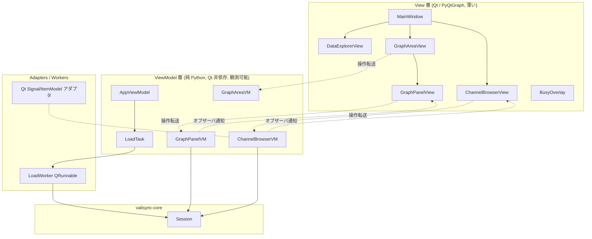

# Design Document: valisync-gui-mvp

## Overview

`valisync-gui-mvp` は ValiSync GUI の「歩く骨格（walking skeleton）」である。`valisync-core` の Session を唯一の窓口として、ファイル読み込み・信号閲覧・波形表示・ズーム/パン・動的 LOD 描画を、ドッキング UI 上で end-to-end に成立させる。狙いは個々の機能の作り込みではなく、**統合の成立性**（PySide6 + QDockWidget + PyQtGraph + MVVM 配線 + 実データ性能）を最初に検証することにある。

設計原則:

- **MVVM・厳格分離**: View（Qt/PyQtGraph、薄い）/ ViewModel（純 Python、Qt 非依存、観測可能）/ Model（Session・コアデータ）。GUI はコアモジュールを直接 import せず Session 経由のみ（親 R27）
- **コアデータは読み取り専用**: Signal の numpy 配列は `writeable=False` のまま参照しコピーしない
- **動的 LOD を最初から**: ズーム/パン連動の min-max ダウンサンプリングをデータパスに組み込み、数百万点で実用精度かつ 60fps を達成（親 R21）
- **AI エージェント実機テスト容易性**: ロジックを Qt から切り離し、ディスプレイ非依存で駆動・検査できる構造にする

### 技術選定

| 項目 | 選定 | 理由 |
|---|---|---|
| Qt バインディング | **PySide6**（LGPL） | 将来の商用配布でもライセンス制約が緩い |
| 波形描画 | **PyQtGraph** | 高速・numpy 直結 |
| ドッキング | **Qt 標準 QMainWindow + QDockWidget** | R1 要件（ドック/フロート/タブ化/再表示）を標準 API で充足、最小依存 |
| MVVM 結合 | **純 Python VM + 薄い Qt アダプタ View** | ヘッドレステスト容易性を最優先 |
| 読込スレッド | **QThreadPool/QRunnable ワーカー + 不確定ビジー表示** | UI を固めず「応答中」を視認可能。キャンセル/確定進捗は不要 |

### 着手前のコア前提作業（valisync-core 側）

1. **Task 8.2（Session）完了** — `load(path)` / Signal_Group 参照 / `downsample(...)` を公開
2. **`Downsampler` を O(N) ベクトル化** — 現実装は O(n_buckets × N) で毎フレーム描画に不適。バケット割当をインデックス演算 + `np.minimum.reduceat`/`np.maximum.reduceat` で O(N) 化する。出力契約（min-max・厳密単調・不変条件）は不変、性能のみ改善。既存 PBT（Property 21/22）で契約を再検証

## Architecture

### レイヤ構造



### `gui/` モジュール構成

```
src/valisync/gui/
├── app.py                      # QApplication entry、Session 生成、MainWindow 起動
├── main_window.py              # QMainWindow: ドック配置・メニュー・ツールバー・起動時復元(QSettings)
├── viewmodels/                 # 純 Python（Qt 非依存）
│   ├── observable.py           # 最小オブザーバ基盤（subscribe / notify）
│   ├── app_viewmodel.py        # アプリ全体状態（読込済みファイル・アクティブタブ・データソース一覧）
│   ├── channel_browser_vm.py   # 信号ツリー・検索・選択・表示トグル
│   ├── graph_area_vm.py        # タブ群とパネル構成・X 軸同期 ON/OFF
│   ├── graph_panel_vm.py       # 1 パネル: 表示信号・色割当・X/Y 範囲・LOD 状態
│   └── load_task.py            # ワーカー読込の VM 側状態（idle/loading/done/error）
├── views/                      # 薄い Qt アダプタ
│   ├── channel_browser_view.py # QTreeView + ItemModel アダプタ + 検索ボックス
│   ├── data_explorer_view.py   # 独立ウィンドウ（QMainWindow）: データソースツリー
│   ├── graph_area_view.py      # QTabWidget + QSplitter（垂直パネル分割）
│   ├── graph_panel_view.py     # PyQtGraph PlotWidget ラッパ + ズーム/パン + LOD 連携
│   └── busy_overlay.py         # 不確定ビジー表示
├── adapters/
│   └── qt_signal_models.py     # 純 VM → QAbstractItemModel 橋渡し
├── workers/
│   └── load_worker.py          # QRunnable: Session.load() をオフスレッド実行
└── persistence/
    └── data_sources.py         # 登録データソース一覧の JSON 永続化
```

> `src/valisync/` 配下の構造追加につき、本構成はユーザー承認済み（[[project-architecture]] の gui/ 区分に整合）。

### 依存規則

```
views/      → viewmodels/, adapters/  (Qt/PyQtGraph に依存)
viewmodels/ → valisync.core.Session のみ  (Qt 非依存)
adapters/   → viewmodels/, Qt
workers/    → valisync.core.Session, Qt(QRunnable)
gui/ 全体   → valisync.core の loaders/sync/formula/export/downsampler を直接 import しない（親 R27.4）
```

## Components and Interfaces

### MainWindow（views/main_window.py）

- QMainWindow。Channel_Browser と Graph_Area をいずれも独立 QDockWidget として配置する（親 R1.1）。central widget はプレースホルダ（または非使用）とし、両ドックを並べる
- 既定レイアウト: 左に Channel_Browser ドック、右に Graph_Area ドック
- メニュー / ツールバー: Data_Explorer 起動ボタン、閉じたドックの再表示（`QDockWidget.toggleViewAction`）
- 起動時に QSettings からウィンドウ位置・サイズを復元（親 R2.3/R28.4）

### ViewModel 基盤（viewmodels/observable.py）

```python
class Observable:
    def subscribe(self, callback: Callable[[str], None]) -> Callable[[], None]: ...
    def _notify(self, change: str) -> None: ...
```

- 全 VM はプレーンな Python オブジェクト。状態変化を文字列タグ付きで通知。View はタグを見て差分更新
- Qt の Signal/Slot には依存しない（ヘッドレステストで `subscribe` を直接使える）

### GraphPanelVM（viewmodels/graph_panel_vm.py）— 中核

状態:
- `signals: list[PlottedSignal]`（signal_key, 色, 表示/非表示）
- `x_range: tuple[float, float]`, `y_range: tuple[float, float]`
- `panel_width_px: int`（View からリサイズ時に同期）
- `lod_active: bool`, `last_rendered_points: int`（検査用・親 R21.6/R27.6）

操作:
- `add_signal(signal_key)` / `remove_signal(signal_key)` / `toggle_visibility(...)`
- `set_x_range(lo, hi)` / `set_y_range(lo, hi)` / `reset_x()` / `reset_y()`
- `render_data() -> list[RenderCurve]` — 表示すべき各信号の (timestamps, values) を返す。内部で **動的 LOD**（下記）を実行

検査用 API（親 R27.6）: `inspect() -> dict` で表示信号・範囲・色・lod_active・last_rendered_points を構造化返却。

### 動的 LOD パイプライン（GraphPanelVM 内 + Session）

`render_data()` が呼ばれる契機: 信号追加・X/Y 範囲変更・パネルリサイズ。各信号について:

1. **可視範囲スライス**: Signal の timestamps は単調増加 → `np.searchsorted` で `[x_lo, x_hi]` の index 区間を O(log n) 特定
2. **目標点数**: `n = clamp(2 * panel_width_px, 2, ...)`（min-max は区間あたり 2 点）
3. **Session 経由 DS**: 可視スライスの Signal を `Session.downsample(slice_signal, n)` に渡し min-max 間引き（親 R21.5、R27.2）。スライス長 ≤ n ならパススルー（生データ表示）
4. **状態更新**: `lod_active = (返り点数 < スライス長)`、`last_rendered_points = 返り点数`
5. View が結果配列で `PlotDataItem.setData`

性能設計（親 R21.2 / R9.5 / R10.5 の 16ms）:
- **debounce / スロットル**: 連続ドラッグ中は毎フレーム再 DS せず、短いタイマ（~16–30ms 結合）で再計算。ドラッグ中はビュー変換で追従、停止時に最終解像度へ
- **キャッシュ**: 直近の `(x_lo, x_hi, n)` と結果を保持し、不変なら再計算スキップ
- **有界負荷**: 描画点数は常に `~2 * panel_width_px` に有界 → 総サンプル数に依存しない

### X 軸同期（graph_area_vm + PyQtGraph）

- GraphAreaVM が `x_sync_enabled: bool` を保持（親 R7.3）
- 有効時: 同一 Graph_Area 内の全 GraphPanelView の ViewBox を `setXLink` で連結 → 1 パネルのズーム/パンが全パネルへ伝播（親 R7.2）。各パネルは連動した範囲変更を契機に個別に LOD 再計算
- 無効時: `setXLink(None)` で独立（親 R7.4）

### ズーム/パン（graph_panel_view、親 R9/R10）

- X 軸・Y 軸領域を内側/外側ゾーンに分割。PlotWidget 上のマウスイベントをハンドリング:
  - 内側ドラッグ → 範囲選択ズーム（開始/終了座標を新範囲に）
  - 外側ドラッグ → パン
  - ホイール → カーソル位置中心ズーム
  - ダブルクリック → 全範囲（X）/ 全信号値範囲（Y）リセット
  - ゾーン境界ホバーでカーソル形状変更（操作種別の視覚提示）
- 範囲確定は `GraphPanelVM.set_x_range/set_y_range` を呼び、VM が LOD 再計算をトリガ

### Channel_Browser（views + adapters、親 R4）

- QTreeView。`qt_signal_models.py` の QAbstractItemModel アダプタが ChannelBrowserVM のツリー状態を Qt に橋渡し
- 検索ボックス → `ChannelBrowserVM.set_filter(text)` → 通知でツリー絞り込み（親 R4.4 incremental search）
- 信号メタ（型・サンプル数・時間範囲）は VM が Session の Signal から読んで列に提供
- D&D: 選択信号の signal_key 群を QMimeData に載せてドラッグ。GraphPanelView がドロップ受理 → `GraphPanelVM.add_signal`

### Data_Explorer（views/data_explorer_view.py、親 R3）

- ツールバーから開く独立 QMainWindow（親 R1.5）
- QFileSystemModel ベースのツリー。登録フォルダをルートに表示。拡張子からフォーマットアイコンを簡易判定（親 R3.2）
- ダブルクリック/Enter/コンテキストメニュー → `AppViewModel.request_load(path)`
- 登録データソース一覧は `persistence/data_sources.py` が JSON で保存/復元（親 R3.5、検査容易性のため平易な JSON）

### ファイル読込ワーカー（workers/load_worker.py、親 R2.4/R2.5）

- `AppViewModel.request_load(path)` が `LoadTask` を loading 状態にし、`LoadWorker(QRunnable)` を QThreadPool に投入
- ワーカーは `Session.load(path)` を呼ぶ（Signal は不変・新オブジェクトのためスレッド安全）。完了/失敗を queued シグナルでメインスレッドへ
- 読込中は `BusyOverlay`（不確定スピナー）を表示。完了で ChannelBrowserVM を更新
- 予算 ≒15s。超過してもブロックはしない（ビジー表示継続）

## Data Flow（代表シナリオ）

```
[ファイル読込→波形表示]
ユーザー: Data_Explorer でファイルをダブルクリック
  → AppViewModel.request_load(path)
  → LoadWorker(QRunnable) で Session.load(path)  [別スレッド, BusyOverlay 表示]
  → 完了通知（queued）→ AppVM が SignalGroup を登録 → ChannelBrowserVM 更新通知
  → ChannelBrowserView がツリー再描画
ユーザー: 信号を Graph_Panel にドラッグ&ドロップ
  → GraphPanelVM.add_signal(signal_key)（色割当）→ render_data()
  → 可視範囲スライス → Session.downsample → RenderCurve
  → GraphPanelView が PlotDataItem.setData + 凡例更新
ユーザー: X 軸をズーム
  → GraphPanelView がゾーン判定し set_x_range → (X同期ONなら setXLink で全パネル連動)
  → debounce 後 render_data() 再実行（新範囲で再 LOD）
```

## Error Handling（親 R27.5）

- Session が返すエラー（ファイル不存在・不正フォーマット・空データ等）は LoadTask の error 状態へ。View が QMessageBox 等で内容を表示し、アプリは継続
- VM 層は例外を握りつぶさず error 状態として公開（テストで assert 可能）
- 空信号（サンプル数 0）は正常系として空グラフ + 凡例表示（親 R8.5）

## Testing Strategy

AI エージェントによる実機テスト・不具合特定を主眼に、3 層で検証する。

1. **ヘッドレス VM テスト（Qt/ディスプレイ不要）**
   - 純 Python VM を直接生成し、操作メソッドを叩いて `inspect()` で状態を assert
   - LOD ロジック（searchsorted スライス・目標点数・lod_active・点数有界性）を Session と組み合わせて検証
   - 大半のロジック不具合をここで捕捉。高速・決定的
2. **Qt 層テスト（pytest-qt、offscreen）**
   - `QT_QPA_PLATFORM=offscreen` で QtBot によりクリック/キー/ドラッグを模擬
   - ドッキング・タブ・パネル分割・D&D・ズーム/パン操作が VM 状態に正しく反映されることを検証
3. **視覚検証**
   - `QWidget.grab()` でスクリーンショットを取得し、波形描画・凡例・レイアウトをエージェントが目視確認
- 性能（親 R21.2 60fps / R9.5・R10.5 16ms）は、代表データ（100 万点合成 Signal）で render_data() の所要時間とフレーム時間を計測するベンチで担保

## 設計上の決定事項（トレーサビリティ）

| 決定 | 親要件 | 備考 |
|---|---|---|
| PySide6 採用 | — | ライセンス（LGPL） |
| 純 Python VM + 薄い View | R27 | ヘッドレステスト容易性 |
| 動的 LOD を MVP に統合 | R21 | 静的 DS はズームイン時に細部が見えず不可 |
| Downsampler O(N) 化（コア前提作業） | R21 | 16ms 予算の根本対処 |
| 読込ワーカー + 不確定ビジー、予算≒15s | R2 | キャンセル/確定進捗は不要 |
| データソース一覧=JSON / 窓位置=QSettings | R3.5, R28.4 | Layout_Template(親 R2) は Phase3 |

## 未解決事項 / 後続 sub-spec への申し送り

- 複数 Y 軸・X-Y プロット（`valisync-gui-axes`）導入時、GraphPanelVM の「単一共通 Y 軸」前提を Y 軸コレクションへ拡張する必要がある。本 MVP の GraphPanelVM はその拡張を見据え、信号→軸の関連を将来差し替え可能な形にしておく
- 動的 LOD の超大規模対応（数千万点超）は、必要になれば事前計算の多解像度ピラミッドを別途検討（現要件 100 万点では O(N) で十分）
