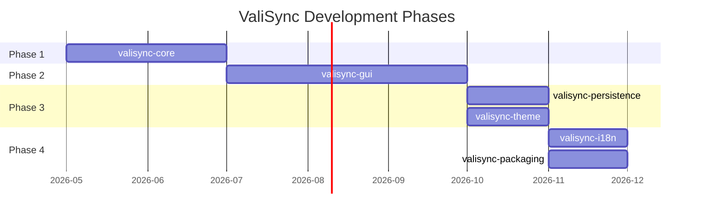
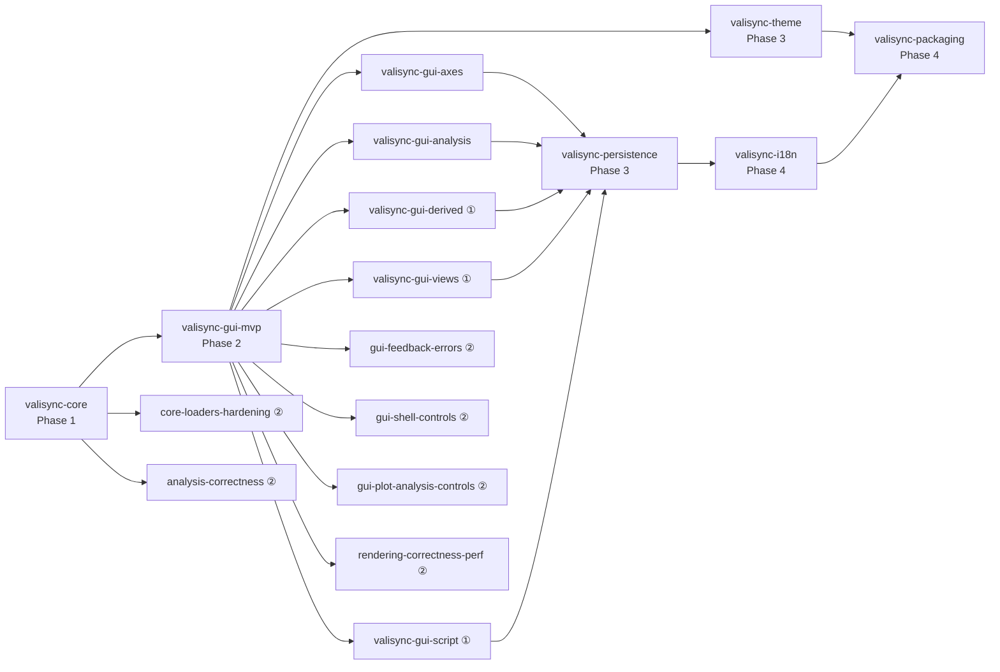

# ValiSync Roadmap

プロジェクト全体の開発フェーズと各 spec の関係を俯瞰するドキュメント。

関連:
- `.kiro/specs/` — 完了済み Phase 1/2 spec のアーカイブ（requirements / design / tasks）
- `docs/superpowers/{specs,plans}/` — 新規計画の一次情報源
- `CLAUDE.md` — Phase 状況テーブル（進捗管理）
- `docs/product.md` — プロダクト概要・原則

---

## Phase 概要

---

## Phase 1: データ処理基盤（valisync-core）

**目標**: GUI に依存しない純粋なデータ処理ライブラリを完成させる。

| Spec | 状態 | 概要 |
|------|------|------|
| `valisync-core` | requirements + design + tasks 完備 | Signal データモデル、MDF4/CSV ローダー、時刻同期、Formula エンジン、補間、統計、ダウンサンプラー、Calcbar、CSV エクスポート、Session |

### スコープ

- 不変データモデル（Signal, Signal_Group, FormatDefinition）
- MDF4 統合ローダー（CAN/XCP/Ethernet を asammdf で一括処理）
- CSV ローダー（FormatDefinition ベース）
- TimeSynchronizer（オフセット適用 + Unified_Timeline）
- Formula エンジン（再帰下降パーサー、入れ子 100 階層）
- Interpolator（線形補間・前値保持・最近傍）
- RangeStatistics（平均・最大・最小・標準偏差・サンプル数）
- Downsampler（min-max アルゴリズム）
- Calcbar 演算（移動平均・線形回帰・微分・積分）
- CSV エクスポート（原子性保証）
- Session オーケストレーション層

### 完了条件

- 全ユニットテスト + プロパティベーステスト通過
- 品質ゲート（pytest / ruff / mypy）クリア
- GUI 層なしで全コア機能が Session 経由で利用可能

---

## Phase 2: GUI 実装（valisync-gui）

**目標**: PyQt6/PySide6 + PyQtGraph による高速波形可視化デスクトップアプリケーションを完成させる。

巨大な親 spec `valisync-gui`（requirements.md に 29 要件）を、統合リスクを早期検証する **MVP 垂直スライス**方針で **6 つの sub-spec** に分解する（2026-05-27 決定）。親 `valisync-gui/requirements.md` を一次情報源として保持し、各 sub-spec は該当要件を抽出して requirements/design/tasks を持つ。（その後 `valisync-gui-file-browser` を mvp から分離して追加。`analysis` は **R14–R17 完了**（増分A=R15 Global Cursor PR #21/#22・B=R16 Delta+R17 範囲統計 PR #23・C=R14 時間オフセット PR #25、realgui ①証拠ゲート充足）、`derived`/`views`/`script` は未着手。各 sub-spec 表の「状態」列は着手当時のもので、最新の完了状況は CLAUDE.md Phase 表を一次とする。**横断 / realgui カバレッジ拡充（Phase 1-7）**: low クラスタ＋C3 昇格（Plan 7 実装）で監査 missing 解消・全フェーズ実装完了（merge 前 ①ゲートで実機実証予定）— 詳細は `docs/realgui-coverage-audit.md`。）

**バケット分類**: 各 sub-spec は「① 今後実装予定（未着手の新機能）」と、既存機能の欠陥を束ねる「② 実装済みだが不足（改善サブスペック）」に分ける。②の全課題は ID 付きで [audit-findings-catalog.md](audit-findings-catalog.md) が一次情報源。

**① 機能サブスペック**（親 `valisync-gui` の要件分解。状態は CLAUDE.md Phase 表を一次とする）

| sub-spec | 担当要件（親 R番号） | 状態 | バケット | 概要 |
|------|------|------|------|------|
| `valisync-gui-mvp` | R1, R3–R8.5, R12, R13, R21, R22, R27–R29(最小) | **完了**（PR #1/#2 merged） | — | 歩く骨格: シェル/ドッキング・データ取込/閲覧・タブ/パネル分割・基本Y-T波形・X/Yズーム/パン・**動的LOD**・X 軸同期・D&D・コンテキストメニュー |
| `valisync-gui-file-browser` | （分離） | **完了**（PR #3 merged） | — | FileBrowser 分離・マスター/ディテール |
| `valisync-gui-axes` | R8.6–8.18 | **完了**（PR #4/#13/#14/#16/#17/#19 merged） | — | 複数Y軸レイアウト（独立スケール・高さ比率・自由配置・軸ごとリサイズ） |
| `valisync-gui-analysis` | R14, R15, R16, R17 | **完了**（PR #21–#25 merged・realgui ①ゲート充足） | — | Global/Deltaカーソル・範囲統計表示・Drag-offset（時間オフセット） |
| 横断 / realgui カバレッジ拡充 | — | **完了**（Phase 1-7・PR #27–#35） | — | headless false-green 経路を実 OS 入力（Layer C）で検証 |
| `valisync-gui-derived` | R18, R19 | 未着手 | ① | Calcbar UI + Formula エディタ（構文ハイライト・補完） |
| `valisync-gui-views` | R9, R10, R11 | 未着手 | ① | Table / 棒グラフ / コンタープロット |
| `valisync-gui-script` | R20 | 未着手 | ① | Python Script Console（スクリプティング統合） |

**② 改善サブスペック（実装済みだが不足）** — 一次情報源: [audit-findings-catalog.md](audit-findings-catalog.md)（実ユーザージャーニー監査で確定した 64 課題・補遺 LD-12/LD-13 で 66 課題・ユーザー実機発見 2026-07-05 で PC-21/PC-22/RN-06 追加し計 69 課題を割当）

| 改善サブスペック | 主眼 | 件数 | 優先 | 代表課題（catalog ID） |
|------|------|------|------|------|
| `gui-feedback-errors` | エラー/診断/状態フィードバックの可視化 — **完了: 第1弾（PR #37）＋第2弾（PR #38）で FB-01〜10 全10課題解消** | 10 | ✅完了 | FB-01 全ロード失敗が無言・FB-02 Session が skip 診断を破棄（→全て解消） |
| `gui-shell-controls` | シェル操作（File メニュー・タブ/パネル/レイアウト管理・エクスポート導線） — **増分1a（入口: SH-01/07・Open/Welcome/Recent/ShellActions）実装済み＋増分1b（出口: SH-03・Export ダイアログ＋csv_exporter 拡張＋オフスレッド）実装済み＝増分1（File I/O 導線）完結** | 15 | 🔴高 | ~~SH-01 File>Open 無し~~✅解消（増分1a）・~~SH-07 File Browser 操作無し~~✅解消（増分1a）・~~SH-03 エクスポート導線~~✅解消（増分1b）・SH-12 ドックトグルボタン |
| `gui-plot-analysis-controls` | プロット/曲線/軸/カーソルの操作コントロール | 22（PC-21/13/14/22 解消済み） | 🟠中 | PC-01 曲線管理コントロール無し・PC-03 オフセット操作が隠れ・PC-11 単位無し・~~PC-21 readout 崩れ~~✅解消（増分①）・~~PC-13/14/22 軸/カーソル形状~~✅解消（増分②: カーソルレジストリ＋X zoom/pan 区別・Y 統一・非アクティブ軸 PointingHand・カーソル線 SizeHor・オフセットアフォーダンス） |
| `core-loaders-hardening` | ローダー堅牢性・対応形式拡張 — **完了: 第1弾（TS 堅牢化 LD-03/04/05/06/08/09・PR #39）＋第3弾（LD-07/10/12/13・LD-11 仕様判断・PR #43）＋LD-14（ndim≥3 多段展開＋1024 ガード）＋第2弾（開く経路 LD-01 CSV 自動検出＋確認ダイアログ・LD-02 .mdf/.dat 受理＋MdfLoader リネーム）で全 LD 解消** | 14 | ✅完了 | 全 LD-01〜14 解消（第2弾: LD-01 CSV 開ける・LD-02 .mdf/.dat 受理） |
| `analysis-correctness` | 統計・補間の計算の正しさ — **完了: AN-01/02/03 を `Signal.finite_view()` 共通土台で解消** | 3 | ✅完了 | AN-01 範囲統計の NaN 汚染（→有限のみ集計）・AN-02 補間の NaN 伝播（→有限間補間）・AN-03 単一サンプル読み取り（→ZOH 前方保持） |
| `rendering-correctness-perf` | 描画の正しさ・LOD/同期の性能 — **RN-01/RN-02（描画正しさ）＋RN-06（カーソル移動 perf）解消済み**。残り RN-03/04/05（性能・Y 軸退化） | 6 | 🟠中 | RN-01/RN-02 解消。RN-06✅解消（増分①: 範囲統計 O(√n)＋readout 差分更新）。残り RN-03 リサイズ毎 LOD 再計算・RN-04 X 同期の重さ・RN-05 定数信号の零幅 Y 軸 |

> ②の着手起点は `gui-feedback-errors`（FB-01/FB-02）。サイレント失敗連鎖の元を断つと、`core-loaders-hardening`・`gui-shell-controls` の欠陥が「気づける」ようになる。各改善サブスペックも着手時に `brainstorming` → `writing-plans` から始め、catalog の ID を要件参照点に使う。
>
> **`gui-feedback-errors` は完了**: 第1弾（FB-01/02/03/06＝案A 診断伝播＋Diagnostics ドック/モーダル/ステータスバー・PR #37、spec: [2026-07-02-gui-feedback-errors-design.md](superpowers/specs/2026-07-02-gui-feedback-errors-design.md)）＋第2弾（FB-04/05/07/08/09/10＝ハイブリッドキャンセル＋ヘッダ/タイトル/プレースホルダ/ツールチップ・PR #38、spec: [2026-07-03-gui-feedback-errors-r2-design.md](superpowers/specs/2026-07-03-gui-feedback-errors-r2-design.md)）。follow-up 候補（CSV ストリーミング化・ツールチップ stat の off-thread 化等）は第2弾プランの Status 節と PR #38 参照。
>
> **`core-loaders-hardening` 第1弾（TS 堅牢化）は PR #39 で実装済み**: `Signal` の厳密単調検証を撤廃し「記録どおり保持＋整列ビュー `sorted_view()`（keep-last・zero-copy fast path）」へ転換、全消費経路を切替え、ローダーは異常を検出診断（LD-03/04/05/06/08/09 解消）。spec: [2026-07-03-core-loaders-hardening-design.md](superpowers/specs/2026-07-03-core-loaders-hardening-design.md)。
>
> **第3弾（LD-07/10/12/13 解消・LD-11 仕様判断）実装済み（PR #43）**: MDF4 読み取りパスを `select(ignore_value2text_conversions=True, copy_master=False)` ベースに刷新し、LD-13（value2text 付きチャンネルの enum 消滅）と LD-10（配列多重コピーによるメモリ膨張。実測 hils 2.01GB: before 7.8 秒/+7.3GB → after 3.05 秒/+2.53GB、受け入れ基準 ≤+3.0GB／≤7.8 秒を充足）を解消。LD-12（多次元/構造化チャンネルの列/フィールド展開・上限なし）と LD-07（value2text を `metadata['value_labels']` に保持しカーソル readout・ChannelBrowser tooltip に併記）を実装。LD-11（同一ファイル二重読み込みの別グループ増殖）は 2026-07-05 ユーザー決定によりリポジトリの仕様として許容（再読込操作は必要になれば別途起票）。spec: [2026-07-05-core-loaders-hardening-r3-design.md](superpowers/specs/2026-07-05-core-loaders-hardening-r3-design.md)。**LD-10 の次段（将来課題）**: 現状はコピー排除まで＝全信号をロード時に一括実体化（データ実体1コピー分・hils 2GB で +2.53GB）。さらに削減が必要になったら遅延ロード/メモリマップ（Signal/Session の契約変更を伴う大改修）を別増分として検討。**LD-14（ndim≥3 多段展開＋1024 ガード）実装済み**: `_explode_samples` を任意 ndim の再帰フラット展開（`Name[i][j]…`）へ一般化し 3D 以上の物標行列も展開可能に。per-channel の展開列数が 1024 を超えるチャンネルは本読み前の 1 レコードプローブ（`select(record_count=1)`）で検出し、GUI ポップアップ（チェックボックス一覧・ワーカー→GUI スレッド marshal）で展開/スキップを選択（ヘッドレスは全スキップ＋警告）。承認されない超過は本読み entries から除外しメモリ/時間も節約。LD-12 の「列数上限なし」を改訂。spec: [2026-07-05-ld14-ndim-flatten-design.md](superpowers/specs/2026-07-05-ld14-ndim-flatten-design.md)。**残りは第2弾（開く経路 LD-01 CSV ピッカー〔SH-01 連携〕・LD-02 拡張子）のみ**。次の候補は `gui-shell-controls` または LD 第2弾。
>
> **`analysis-correctness`（AN-01/02/03）完了**: 統計・補間のサイレント誤計算を、値が非有限のサンプルを除いた共通ビュー `Signal.finite_view()`（`sorted_view` と同型のキャッシュ＋zero-copy fast path＋delegate）で解消。AN-01=範囲統計を有限値のみで算出し `count` を範囲内の有限数に／AN-02=補間で NaN を欠測として除外し前後の有限サンプル間で補間／AN-03=単一有限サンプルは ZOH 前方保持（`t≥ts0` で値・`t<ts0` は None）。描画（RN クラスタ）は不変更で責務分離。spec: [2026-07-05-analysis-correctness-design.md](superpowers/specs/2026-07-05-analysis-correctness-design.md)／plan: [2026-07-05-analysis-correctness.md](superpowers/plans/2026-07-05-analysis-correctness.md)。
>
> **`rendering-correctness`（RN-01/RN-02）完了**: 描画のサイレントなデータ欠落を解消。RN-01=X 窓スライスを窓外の隣接サンプル1点ずつまで拡張し、窓内にサンプルが無くても窓を横切る線分を描く（疎信号のズーム消失を解消・窓が信号域外なら境界1点は可視域外でクリップ＝外挿の捏造なし）。RN-02=`_x_range_is_auto` フラグで「自動フィット中は追加信号のたび x_range を全信号の時間和集合へ拡張・手動ズーム後は尊重（Reset X が受け皿）」を実現し、別時間域の2本目信号が窓外で無表示になる問題を解消。X 同期は `set_x_range` 経由で手動追従。残りは RN-03/04/05（性能・Y 軸退化）。spec: [2026-07-05-rendering-correctness-design.md](superpowers/specs/2026-07-05-rendering-correctness-design.md)／plan: [2026-07-05-rendering-correctness.md](superpowers/plans/2026-07-05-rendering-correctness.md)。

**境界判断**:
- **LOD（R21）は MVP に統合**（当初は独立 spec 案）。静的DSはズームイン時に生データ細部・スパイクが見えず ADAS 解析に不十分なため、viewport 連動の動的DSを最初から導入し実用精度を確保
- **Layout_Template 保存/復元（親 R2）は Phase3 `valisync-persistence` へ委譲**（ワークスペース直列化＝セッション永続化と同責務）。GUI 側には R28 の最小の起動時復元のみ残す
- 親 R23–26（Interpolator/RangeStats/Downsampler/Calcbar 演算のコア拡張）は Phase 1 `valisync-core` で実装済み（依存先・充足済み）

### スコープ

- ドッキングウィンドウシステム（QDockWidget）
- Graph_Area タブ管理 + Graph_Panel 分割表示
- Waveform_View（Y-T モード / X-Y プロットモード）
- 複数 Y 軸（独立スケール・高さ比率・配置変更）
- テーブル表示 / 棒グラフ / コンタープロット
- X 軸・Y 軸ズーム・パン（内側/外側ゾーン方式）
- Global_Cursor + Delta_Cursor + 範囲統計表示
- ドラッグ＆ドロップ（ファイル読み込み・信号追加・時間オフセット）
- Channel_Browser + Data_Explorer
- Formula エディタ（構文ハイライト・補完）
- Script Console（Python スクリプティング統合）
- Calcbar UI
- LOD レンダリング（動的ダウンサンプリング）
- コンテキストメニュー
- MVVM アーキテクチャ（Session 経由のみ）

### 完了条件

- 全 GUI 要件の受け入れ基準を満たす
- 100 万サンプル以上で 60fps レンダリング
- Session 経由以外のコアアクセスがないことを確認

### 前提

- Phase 1（valisync-core）完了

---

## Phase 3: UX 強化（persistence + theme）

**目標**: GUI 完成後に日常利用の快適性を高める機能を追加する。

| Spec | 状態 | 概要 |
|------|------|------|
| `valisync-persistence` | 未作成 | セッション永続化（プロジェクトファイル保存/復元） |
| `valisync-theme` | 未作成 | GUI テーマ切替（ライト/ダークモード） |

### valisync-persistence スコープ（想定）

- 解析セッション全体の保存/復元（プロジェクトファイル `.vsproj` 等）
- 保存対象: 読み込みファイルパス、オフセット設定、Formula 定義、Derived_Signal 再現情報、Layout_Template、表示設定
- JSON ベースのプロジェクトファイルフォーマット
- 最近使ったプロジェクトの一覧
- 自動保存（クラッシュリカバリ）
- **Formula 定義の外部ファイル化**
  - Formula 定義を独立した JSON ファイルとして保存・管理
  - Formula ライブラリ（複数の Formula 定義をまとめたコレクション）のインポート/エクスポート
  - チーム間での Formula 定義共有（ファイルコピーまたはネットワークドライブ経由）
  - FormatDefinition と同様の CRUD パターン（`data/formulas/` ディレクトリ）
  - GUI の Formula エディタからの保存/読み込み連携

### valisync-theme スコープ（想定）

- ライトモード / ダークモードの切替
- OS のシステム設定に追従するオプション
- グラフ背景色・グリッド色・波形デフォルト色のテーマ連動
- ユーザー設定の永続化

### 前提

- Phase 2（valisync-gui）完了

---

## Phase 4: リリース準備（i18n + packaging）

**目標**: エンドユーザーへの配布と多言語対応を実現する。

| Spec | 状態 | 概要 |
|------|------|------|
| `valisync-i18n` | 未作成 | 国際化（日本語/英語 UI 切替） |
| `valisync-packaging` | 未作成 | .exe 化（デスクトップアプリ配布） |

### valisync-i18n スコープ（想定）

- Qt の翻訳機構（QTranslator / .ts / .qm）を使用
- 日本語（デフォルト）+ 英語の 2 言語対応
- UI ラベル・メニュー・ダイアログ・エラーメッセージの翻訳
- 言語切替時の即時反映（アプリ再起動不要が理想）
- 翻訳ファイルの管理方針

### valisync-packaging スコープ（想定）

- PyInstaller による単一 .exe 生成
- Windows 向けインストーラー（NSIS or Inno Setup）
- アプリアイコン・スプラッシュスクリーン
- バージョニング戦略
- CI での自動ビルド（GitHub Actions で .exe アーティファクト生成）
- コード署名（将来検討）

### 前提

- Phase 3（persistence + theme）完了
- i18n は GUI の全テキストが確定した後に着手するのが効率的
- packaging は全機能統合後に配布形態を固める

---

## Spec 一覧と依存関係

---

## 将来検討（スコープ外）

以下は現時点では roadmap に含めないが、将来的に検討する可能性がある領域:

| 領域 | 概要 | 検討タイミング |
|------|------|--------------|
| シナリオバリデーション | 期待値比較・検証ハイライト・Pass/Fail 判定 | Phase 4 完了後 |
| プラグインアーキテクチャ | カスタムローダー・カスタム Formula 関数の外部追加 | ユーザーフィードバック後 |
| クラウド連携 | リモートデータソース・チーム共有 | 組織利用の需要発生時 |
| AD スコープ拡張 | 完全自動運転向けの追加プロトコル対応 | ADAS → AD 移行時 |
