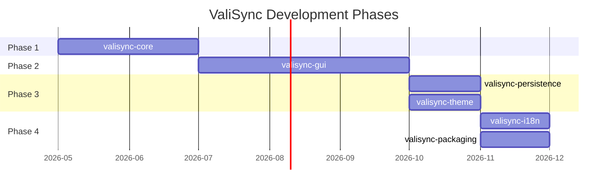
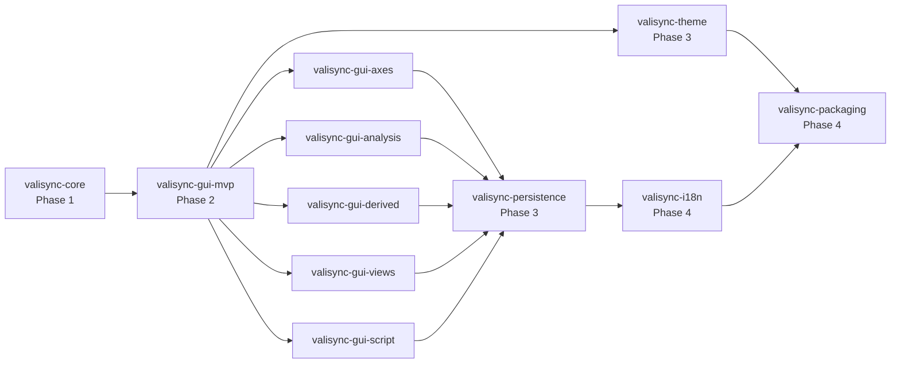

# ValiSync Roadmap

プロジェクト全体の開発フェーズと各 spec の関係を俯瞰するドキュメント。

関連:
- `.kiro/specs/` — 完了済み Phase 1/2 spec のアーカイブ（requirements / design / tasks）
- `docs/superpowers/{specs,plans}/` — 新規計画の一次情報源
- `CLAUDE.md` — Phase 状況テーブル（進捗管理）
- `docs/product.md` — プロダクト概要・原則

---

## Phase 概要

---

## Phase 1: データ処理基盤（valisync-core）

**目標**: GUI に依存しない純粋なデータ処理ライブラリを完成させる。

| Spec | 状態 | 概要 |
|------|------|------|
| `valisync-core` | requirements + design + tasks 完備 | Signal データモデル、MDF4/CSV ローダー、時刻同期、Formula エンジン、補間、統計、ダウンサンプラー、Calcbar、CSV エクスポート、Session |

### スコープ

- 不変データモデル（Signal, Signal_Group, FormatDefinition）
- MDF4 統合ローダー（CAN/XCP/Ethernet を asammdf で一括処理）
- CSV ローダー（FormatDefinition ベース）
- TimeSynchronizer（オフセット適用 + Unified_Timeline）
- Formula エンジン（再帰下降パーサー、入れ子 100 階層）
- Interpolator（線形補間・前値保持・最近傍）
- RangeStatistics（平均・最大・最小・標準偏差・サンプル数）
- Downsampler（min-max アルゴリズム）
- Calcbar 演算（移動平均・線形回帰・微分・積分）
- CSV エクスポート（原子性保証）
- Session オーケストレーション層

### 完了条件

- 全ユニットテスト + プロパティベーステスト通過
- 品質ゲート（pytest / ruff / mypy）クリア
- GUI 層なしで全コア機能が Session 経由で利用可能

---

## Phase 2: GUI 実装（valisync-gui）

**目標**: PyQt6/PySide6 + PyQtGraph による高速波形可視化デスクトップアプリケーションを完成させる。

巨大な親 spec `valisync-gui`（requirements.md に 29 要件）を、統合リスクを早期検証する **MVP 垂直スライス**方針で **6 つの sub-spec** に分解する（2026-05-27 決定）。親 `valisync-gui/requirements.md` を一次情報源として保持し、各 sub-spec は該当要件を抽出して requirements/design/tasks を持つ。（その後 `valisync-gui-file-browser` を mvp から分離して追加。`analysis` は増分A(R15 Global Cursor)完了・B(R16/R17)完了・C(R14)残、`derived`/`views`/`script` は未着手。各 sub-spec 表の「状態」列は着手当時のもので、最新の完了状況は CLAUDE.md Phase 表を一次とする。）

| sub-spec | 担当要件（親 R番号） | 状態 | 概要 |
|------|------|------|------|
| `valisync-gui-mvp` | R1, R3, R4, R5, R6, R7, R8.1–8.5, R12, R13, R21, R22, R27, R28, R29(最小) | **実装完了**（tasks 0〜11 全 `[x]`・454 tests green・`feature/valisync-gui-mvp`・PR 未作成） | 歩く骨格: シェル/ドッキング・データ取込/閲覧・タブ/パネル分割・基本Y-T波形・X/Yズーム/パン・**動的LOD**・X 軸同期・D&D・コンテキストメニュー |
| `valisync-gui-axes` | R8.6–8.18 | 未作成 | 複数Y軸レイアウト（独立スケール・高さ比率・自由配置）+ X-Yプロットモード |
| `valisync-gui-analysis` | R14, R15, R16, R17 | 未作成 | Global/Deltaカーソル・範囲統計表示・Drag-offset（時間オフセット） |
| `valisync-gui-derived` | R18, R19 | 未作成 | Calcbar UI + Formula エディタ（構文ハイライト・補完） |
| `valisync-gui-views` | R9, R10, R11 | 未作成 | Table / 棒グラフ / コンタープロット |
| `valisync-gui-script` | R20 | 未作成 | Python Script Console（スクリプティング統合） |

**境界判断**:
- **LOD（R21）は MVP に統合**（当初は独立 spec 案）。静的DSはズームイン時に生データ細部・スパイクが見えず ADAS 解析に不十分なため、viewport 連動の動的DSを最初から導入し実用精度を確保
- **Layout_Template 保存/復元（親 R2）は Phase3 `valisync-persistence` へ委譲**（ワークスペース直列化＝セッション永続化と同責務）。GUI 側には R28 の最小の起動時復元のみ残す
- 親 R23–26（Interpolator/RangeStats/Downsampler/Calcbar 演算のコア拡張）は Phase 1 `valisync-core` で実装済み（依存先・充足済み）

### スコープ

- ドッキングウィンドウシステム（QDockWidget）
- Graph_Area タブ管理 + Graph_Panel 分割表示
- Waveform_View（Y-T モード / X-Y プロットモード）
- 複数 Y 軸（独立スケール・高さ比率・配置変更）
- テーブル表示 / 棒グラフ / コンタープロット
- X 軸・Y 軸ズーム・パン（内側/外側ゾーン方式）
- Global_Cursor + Delta_Cursor + 範囲統計表示
- ドラッグ＆ドロップ（ファイル読み込み・信号追加・時間オフセット）
- Channel_Browser + Data_Explorer
- Formula エディタ（構文ハイライト・補完）
- Script Console（Python スクリプティング統合）
- Calcbar UI
- LOD レンダリング（動的ダウンサンプリング）
- コンテキストメニュー
- MVVM アーキテクチャ（Session 経由のみ）

### 完了条件

- 全 GUI 要件の受け入れ基準を満たす
- 100 万サンプル以上で 60fps レンダリング
- Session 経由以外のコアアクセスがないことを確認

### 前提

- Phase 1（valisync-core）完了

---

## Phase 3: UX 強化（persistence + theme）

**目標**: GUI 完成後に日常利用の快適性を高める機能を追加する。

| Spec | 状態 | 概要 |
|------|------|------|
| `valisync-persistence` | 未作成 | セッション永続化（プロジェクトファイル保存/復元） |
| `valisync-theme` | 未作成 | GUI テーマ切替（ライト/ダークモード） |

### valisync-persistence スコープ（想定）

- 解析セッション全体の保存/復元（プロジェクトファイル `.vsproj` 等）
- 保存対象: 読み込みファイルパス、オフセット設定、Formula 定義、Derived_Signal 再現情報、Layout_Template、表示設定
- JSON ベースのプロジェクトファイルフォーマット
- 最近使ったプロジェクトの一覧
- 自動保存（クラッシュリカバリ）
- **Formula 定義の外部ファイル化**
  - Formula 定義を独立した JSON ファイルとして保存・管理
  - Formula ライブラリ（複数の Formula 定義をまとめたコレクション）のインポート/エクスポート
  - チーム間での Formula 定義共有（ファイルコピーまたはネットワークドライブ経由）
  - FormatDefinition と同様の CRUD パターン（`data/formulas/` ディレクトリ）
  - GUI の Formula エディタからの保存/読み込み連携

### valisync-theme スコープ（想定）

- ライトモード / ダークモードの切替
- OS のシステム設定に追従するオプション
- グラフ背景色・グリッド色・波形デフォルト色のテーマ連動
- ユーザー設定の永続化

### 前提

- Phase 2（valisync-gui）完了

---

## Phase 4: リリース準備（i18n + packaging）

**目標**: エンドユーザーへの配布と多言語対応を実現する。

| Spec | 状態 | 概要 |
|------|------|------|
| `valisync-i18n` | 未作成 | 国際化（日本語/英語 UI 切替） |
| `valisync-packaging` | 未作成 | .exe 化（デスクトップアプリ配布） |

### valisync-i18n スコープ（想定）

- Qt の翻訳機構（QTranslator / .ts / .qm）を使用
- 日本語（デフォルト）+ 英語の 2 言語対応
- UI ラベル・メニュー・ダイアログ・エラーメッセージの翻訳
- 言語切替時の即時反映（アプリ再起動不要が理想）
- 翻訳ファイルの管理方針

### valisync-packaging スコープ（想定）

- PyInstaller による単一 .exe 生成
- Windows 向けインストーラー（NSIS or Inno Setup）
- アプリアイコン・スプラッシュスクリーン
- バージョニング戦略
- CI での自動ビルド（GitHub Actions で .exe アーティファクト生成）
- コード署名（将来検討）

### 前提

- Phase 3（persistence + theme）完了
- i18n は GUI の全テキストが確定した後に着手するのが効率的
- packaging は全機能統合後に配布形態を固める

---

## Spec 一覧と依存関係

---

## 将来検討（スコープ外）

以下は現時点では roadmap に含めないが、将来的に検討する可能性がある領域:

| 領域 | 概要 | 検討タイミング |
|------|------|--------------|
| シナリオバリデーション | 期待値比較・検証ハイライト・Pass/Fail 判定 | Phase 4 完了後 |
| プラグインアーキテクチャ | カスタムローダー・カスタム Formula 関数の外部追加 | ユーザーフィードバック後 |
| クラウド連携 | リモートデータソース・チーム共有 | 組織利用の需要発生時 |
| AD スコープ拡張 | 完全自動運転向けの追加プロトコル対応 | ADAS → AD 移行時 |
