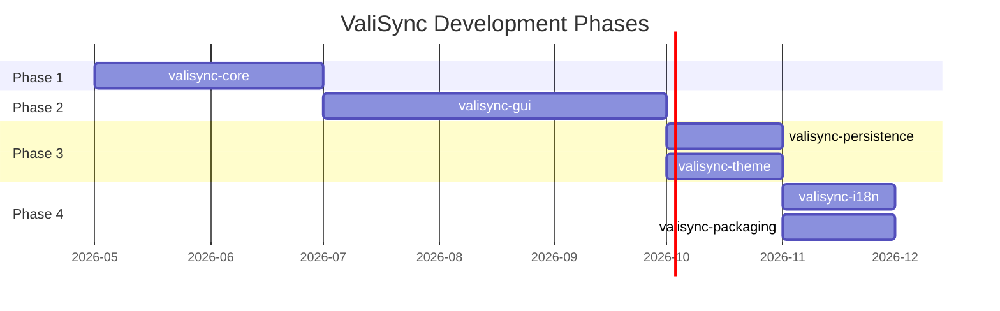
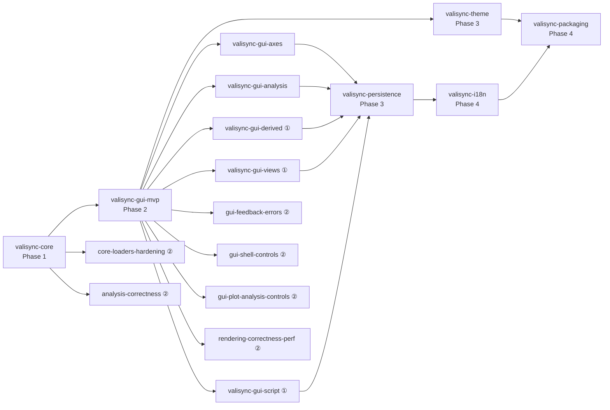

# ValiSync Roadmap

プロジェクト全体の開発フェーズと各 spec の関係を俯瞰するドキュメント。

関連:
- `.kiro/specs/` — 完了済み Phase 1/2 spec のアーカイブ（requirements / design / tasks）
- `docs/superpowers/{specs,plans}/` — 新規計画の一次情報源
- `CLAUDE.md` — Phase 状況テーブル（進捗管理）
- `docs/product.md` — プロダクト概要・原則

---

## Phase 概要

```mermaid
gantt
    title ValiSync Development Phases
    dateFormat YYYY-MM
    axisFormat %Y-%m

    section Phase 1
    valisync-core           :p1, 2026-05, 2026-07

    section Phase 2
    valisync-gui            :p2, after p1, 2026-10

    section Phase 3
    valisync-persistence    :p3a, after p2, 2026-11
    valisync-theme          :p3b, after p2, 2026-11

    section Phase 4
    valisync-i18n           :p4a, after p3a, 2026-12
    valisync-packaging      :p4b, after p3a, 2026-12
```

---

## Phase 1: データ処理基盤（valisync-core）

**目標**: GUI に依存しない純粋なデータ処理ライブラリを完成させる。

| Spec | 状態 | 概要 |
|------|------|------|
| `valisync-core` | requirements + design + tasks 完備 | Signal データモデル、MDF4/CSV ローダー、時刻同期、Formula エンジン、補間、統計、ダウンサンプラー、Calcbar、CSV エクスポート、Session |

### スコープ

- 不変データモデル（Signal, Signal_Group, FormatDefinition）
- MDF4 統合ローダー（CAN/XCP/Ethernet を asammdf で一括処理）
- CSV ローダー（FormatDefinition ベース）
- TimeSynchronizer（オフセット適用 + Unified_Timeline）
- Formula エンジン（再帰下降パーサー、入れ子 100 階層）
- Interpolator（線形補間・前値保持・最近傍）
- RangeStatistics（平均・最大・最小・標準偏差・サンプル数）
- Downsampler（min-max アルゴリズム）
- Calcbar 演算（移動平均・線形回帰・微分・積分）
- CSV エクスポート（原子性保証）
- Session オーケストレーション層

### 完了条件

- 全ユニットテスト + プロパティベーステスト通過
- 品質ゲート（pytest / ruff / mypy）クリア
- GUI 層なしで全コア機能が Session 経由で利用可能

---

## Phase 2: GUI 実装（valisync-gui）

**目標**: PyQt6/PySide6 + PyQtGraph による高速波形可視化デスクトップアプリケーションを完成させる。

巨大な親 spec `valisync-gui`（requirements.md に 29 要件）を、統合リスクを早期検証する **MVP 垂直スライス**方針で **6 つの sub-spec** に分解する（2026-05-27 決定）。親 `valisync-gui/requirements.md` を一次情報源として保持し、各 sub-spec は該当要件を抽出して requirements/design/tasks を持つ。（その後 `valisync-gui-file-browser` を mvp から分離して追加。`analysis` は **R14–R17 完了**（増分A=R15 Global Cursor PR #21/#22・B=R16 Delta+R17 範囲統計 PR #23・C=R14 時間オフセット PR #25、realgui ①証拠ゲート充足）、`derived`/`views`/`script` は未着手。各 sub-spec 表の「状態」列は着手当時のもので、最新の完了状況は CLAUDE.md Phase 表を一次とする。**横断 / realgui カバレッジ拡充（Phase 1-7）**: low クラスタ＋C3 昇格（Plan 7 実装）で監査 missing 解消・全フェーズ実装完了（merge 前 ①ゲートで実機実証予定）— 詳細は `docs/realgui-coverage-audit.md`。）

**バケット分類**: 各 sub-spec は「① 今後実装予定（未着手の新機能）」と、既存機能の欠陥を束ねる「② 実装済みだが不足（改善サブスペック）」に分ける。②の全課題は ID 付きで [audit-findings-catalog.md](audit-findings-catalog.md) が一次情報源。

**UIUX 敵対的レビュー（2026-07-20・PR #134）**: 実装済み GUI 全域を9レンズ×敵対的検証で監査し、確定 78 課題（UX-01..55／UXG-01..28 — audit catalog とは**別 ID 空間**・critical 3=軸表示の実バグ）とデザイン推奨6案・実施順（増分0 知覚の床 → 軸アイデンティティ契約 Stage A → 計測モードバー → 増分D再定義 → 増分E データサイドバー → 増分F 入口と出口）を [uiux-adversarial-review-catalog.md](uiux-adversarial-review-catalog.md) に集約。着手起点は Stage A（[設計 spec](superpowers/specs/2026-07-21-axis-identity-stage-a-design.md)・増分E の前提修正）。

**① 機能サブスペック**（親 `valisync-gui` の要件分解。状態は CLAUDE.md Phase 表を一次とする）

| sub-spec | 担当要件（親 R番号） | 状態 | バケット | 概要 |
|------|------|------|------|------|
| `valisync-gui-mvp` | R1, R3–R8.5, R12, R13, R21, R22, R27–R29(最小) | **完了**（PR #1/#2 merged） | — | 歩く骨格: シェル/ドッキング・データ取込/閲覧・タブ/パネル分割・基本Y-T波形・X/Yズーム/パン・**動的LOD**・X 軸同期・D&D・コンテキストメニュー |
| `valisync-gui-file-browser` | （分離） | **完了**（PR #3 merged） | — | FileBrowser 分離・マスター/ディテール |
| `valisync-gui-axes` | R8.6–8.18 | **完了**（PR #4/#13/#14/#16/#17/#19 merged） | — | 複数Y軸レイアウト（独立スケール・高さ比率・自由配置・軸ごとリサイズ） |
| `valisync-gui-analysis` | R14, R15, R16, R17 | **完了**（PR #21–#25 merged・realgui ①ゲート充足） | — | Global/Deltaカーソル・範囲統計表示・Drag-offset（時間オフセット） |
| 横断 / realgui カバレッジ拡充 | — | **完了**（Phase 1-7・PR #27–#35） | — | headless false-green 経路を実 OS 入力（Layer C）で検証 |
| `valisync-gui-derived` | R18, R19 | 未着手 | ① | Calcbar UI + Formula エディタ（構文ハイライト・補完） |
| `valisync-gui-views` | R9, R10, R11 | 未着手 | ① | Table / 棒グラフ / コンタープロット |
| `valisync-gui-script` | R20 | 未着手 | ① | Python Script Console（スクリプティング統合） |

**② 改善サブスペック（実装済みだが不足）** — 一次情報源: [audit-findings-catalog.md](audit-findings-catalog.md)（実ユーザージャーニー監査で確定した 64 課題・補遺 LD-12/LD-13 で 66 課題・ユーザー実機発見 2026-07-05 で PC-21/PC-22/RN-06 追加し計 69 課題を割当。全6サブスペック完了後の実使用フォローアップ FU-01〜09 を catalog `SS-FOLLOWUP` に登録。**FU-07 完了（PR #77・`prod` プロファイル＝1.36GB/33万ch/120s・これで FU-01 再現確定）、他は未着手。** FU-01〜04・FU-08 不具合・FU-05/06/09 UX・FU-07 デモデータ tooling 強化）

| 改善サブスペック | 主眼 | 件数 | 優先 | 代表課題（catalog ID） |
|------|------|------|------|------|
| `gui-feedback-errors` | エラー/診断/状態フィードバックの可視化 — **完了: 第1弾（PR #37）＋第2弾（PR #38）で FB-01〜10 全10課題解消** | 10 | ✅完了 | FB-01 全ロード失敗が無言・FB-02 Session が skip 診断を破棄（→全て解消） |
| `gui-shell-controls` | シェル操作（File メニュー・タブ/パネル/レイアウト管理・エクスポート導線） — **増分1a（入口: SH-01/07・Open/Welcome/Recent/ShellActions）実装済み＋増分1b（出口: SH-03・Export ダイアログ＋csv_exporter 拡張＋オフスレッド）実装済み＝増分1（File I/O 導線）完結＋増分2a（タブ操作: SH-02/04/13）実装済み＋増分2b（パネル/削除確認/ソース一覧: SH-06/08/10/15）実装済み＝増分2完了＋増分3（シェル chrome: SH-05/11/12/14）実装済み＝全 SH 完結** | 15 | ✅完了 | ~~SH-01 File>Open 無し~~✅解消（増分1a）・~~SH-07 File Browser 操作無し~~✅解消（増分1a）・~~SH-03 エクスポート導線~~✅解消（増分1b）・~~SH-02 新規タブ~~✅解消（増分2a）・~~SH-04 タブを閉じる~~✅解消（増分2a）・~~SH-13 タブ名リネーム~~✅解消（増分2a）・~~SH-06 パネル可視ボタン~~✅解消（増分2b）・~~SH-08 削除確認~~✅解消（増分2b）・~~SH-10 ソース一覧~~✅解消（増分2b）・~~SH-15 Remove Source~~✅解消（増分2b）・~~SH-05 ショートカット~~✅解消（増分3）・~~SH-11 Reset Layout~~✅解消（増分3）・~~SH-12 ドックトグル~~✅解消（増分3）・~~SH-14 ツールバーアイコン~~✅解消（増分3） |
| `gui-plot-analysis-controls` | プロット/曲線/軸/カーソルの操作コントロール — **完了: 統一「アクティブ＋右クリック」操作モデルで PC-01〜22 全22課題解消（増分1 アクティブパネル PC-07/02/04・PR #59／増分2a entry_id＋曲線操作 PC-01/05・PR #61／増分2b 軸/曲線メニュー＋オフセット PC-06/03・PR #63／増分3a カーソル操作＋補間 PC-08/09・PR #65／増分3b readout 刷新 PC-10/11/12/16/17/18・PR #67／増分4 グリッド/ツールチップ/列ソート PC-15/19/20・PR #69＋カーソル UX 増分①② PC-21/13/14/22）** | 22 | ✅完了 | ~~PC-01 曲線管理~~✅解消（増分2a）・~~PC-03 オフセット操作~~✅解消（増分2b）・~~PC-11 単位~~✅解消（増分3b）・~~PC-15 グリッド~~✅解消（増分4）・~~PC-19 ツールチップ~~✅解消（増分4）・~~PC-20 列ソート~~✅解消（増分4）・~~PC-21 readout 崩れ~~✅解消（増分①）・~~PC-13/14/22 軸/カーソル形状~~✅解消（増分②）＝全 PC-01〜22 解消 |
| `core-loaders-hardening` | ローダー堅牢性・対応形式拡張 — **完了: 第1弾（TS 堅牢化 LD-03/04/05/06/08/09・PR #39）＋第3弾（LD-07/10/12/13・LD-11 仕様判断・PR #43）＋LD-14（ndim≥3 多段展開＋1024 ガード）＋第2弾（開く経路 LD-01 CSV 自動検出＋確認ダイアログ・LD-02 .mdf/.dat 受理＋MdfLoader リネーム）で全 LD 解消** | 14 | ✅完了 | 全 LD-01〜14 解消（第2弾: LD-01 CSV 開ける・LD-02 .mdf/.dat 受理） |
| `analysis-correctness` | 統計・補間の計算の正しさ — **完了: AN-01/02/03 を `Signal.finite_view()` 共通土台で解消** | 3 | ✅完了 | AN-01 範囲統計の NaN 汚染（→有限のみ集計）・AN-02 補間の NaN 伝播（→有限間補間）・AN-03 単一サンプル読み取り（→ZOH 前方保持） |
| `rendering-correctness-perf` | 描画の正しさ・LOD/同期の性能 — **完了: RN-01〜06 全6課題解消**（RN-01/02 描画正しさ・RN-06 カーソル perf＋増分1 RN-03/05〔PR #72〕・増分2 RN-04〔PR #73〕） | 6 | ✅完了 | ~~RN-01/RN-02~~✅解消・~~RN-06~~✅解消（増分①: 範囲統計 O(√n)）・~~RN-03 リサイズ毎 LOD~~✅解消（増分1: 幅ガード）・~~RN-05 零幅 Y 軸~~✅解消（増分1: `_padded_range`）・~~RN-04 X 同期の重さ~~✅解消（増分2: ダウンサンプラのベクトル化＋`set_x_range` 不変ガード） |

> ②の着手起点は `gui-feedback-errors`（FB-01/FB-02）。サイレント失敗連鎖の元を断つと、`core-loaders-hardening`・`gui-shell-controls` の欠陥が「気づける」ようになる。各改善サブスペックも着手時に `brainstorming` → `writing-plans` から始め、catalog の ID を要件参照点に使う。
>
> **`gui-feedback-errors` は完了**: 第1弾（FB-01/02/03/06＝案A 診断伝播＋Diagnostics ドック/モーダル/ステータスバー・PR #37、spec: [2026-07-02-gui-feedback-errors-design.md](superpowers/specs/2026-07-02-gui-feedback-errors-design.md)）＋第2弾（FB-04/05/07/08/09/10＝ハイブリッドキャンセル＋ヘッダ/タイトル/プレースホルダ/ツールチップ・PR #38、spec: [2026-07-03-gui-feedback-errors-r2-design.md](superpowers/specs/2026-07-03-gui-feedback-errors-r2-design.md)）。follow-up 候補（CSV ストリーミング化・ツールチップ stat の off-thread 化等）は第2弾プランの Status 節と PR #38 参照。
>
> **`core-loaders-hardening` 第1弾（TS 堅牢化）は PR #39 で実装済み**: `Signal` の厳密単調検証を撤廃し「記録どおり保持＋整列ビュー `sorted_view()`（keep-last・zero-copy fast path）」へ転換、全消費経路を切替え、ローダーは異常を検出診断（LD-03/04/05/06/08/09 解消）。spec: [2026-07-03-core-loaders-hardening-design.md](superpowers/specs/2026-07-03-core-loaders-hardening-design.md)。
>
> **第3弾（LD-07/10/12/13 解消・LD-11 仕様判断）実装済み（PR #43）**: MDF4 読み取りパスを `select(ignore_value2text_conversions=True, copy_master=False)` ベースに刷新し、LD-13（value2text 付きチャンネルの enum 消滅）と LD-10（配列多重コピーによるメモリ膨張。実測 hils 2.01GB: before 7.8 秒/+7.3GB → after 3.05 秒/+2.53GB、受け入れ基準 ≤+3.0GB／≤7.8 秒を充足）を解消。LD-12（多次元/構造化チャンネルの列/フィールド展開・上限なし）と LD-07（value2text を `metadata['value_labels']` に保持しカーソル readout・ChannelBrowser tooltip に併記）を実装。LD-11（同一ファイル二重読み込みの別グループ増殖）は 2026-07-05 ユーザー決定によりリポジトリの仕様として許容（再読込操作は必要になれば別途起票）。spec: [2026-07-05-core-loaders-hardening-r3-design.md](superpowers/specs/2026-07-05-core-loaders-hardening-r3-design.md)。**LD-10 の次段（遅延ロード — `feature/lazy-load-samples`）**: 第3弾時点はコピー排除まで＝全信号をロード時に一括実体化（データ実体1コピー分・hils 2GB で +2.53GB）だったが、**遅延ロード（`Signal.values` の `SampleSource` 抽象化＋MDF ハンドル保持によるオンデマンド読み）を実装済み**。設計: [遅延ロード spec](superpowers/specs/2026-07-24-lazy-load-signal-samples-design.md)（増分A: core 遅延化・増分B: 決定的ハンドル解放＋teardown ペーシング）・[列展開遅延化 spec](superpowers/specs/2026-07-24-deferred-column-expansion-design.md)（E-0/E-1 列キー解決器・E-2 チャンネルブラウザの遅延ツリー）。**増分A／B／E-0／E-1／E-2 は本ブランチで完了**。**増分C は完了**（E-1 Task 4・commit `aa0c37d` の `_OffsetOverlay` で解消）・**増分D は不要**（view 仮想化の 3 項目は既に code に入っており性能上の前提が消滅）— 両者とも遅延ロード spec §増分C/§増分D が一次情報源で「着手しないこと」と明記済み。**最終実測（prod_demo 1.36GB・実 GUI 実行）**: 定常 RSS **801 MB（1 ファイル）／1,336 MB（2 ファイル・コンペア）**、ロード **12.53 秒**（旧 eager は 1 ファイル 1,201 MB / 13.1 秒）、チャンネルブラウザの prep 残渣 **~87 MB → 5.0 MB**、フィルタ 1 適用 **170–213 ms → 125.1 ms**、teardown の最悪ティック **649 ms（ペーシング前）→ 8.2–8.3 ms（未展開グループ）／9.4–13.0 ms（8,004 リーフ展開済み）**。**残り（別ブランチ）**: 列展開側の E-3（ローダーを「物理チャンネル 1 本＝Signal 1 個」へ反転・1024 ガード退役）／E-4（チャンネル単位サンプルキャッシュ・位置ベース selector 等の後始末）。**E-3 の必須ゲート 2 点**: (1) `RemovalResult.removed_columns` を `TeardownService` へ配線する（鋳造列と列キャッシュは `SignalGroup.signals` の外に居るため、配線しないと unload 後もリークして会計から漏れる）、(2) `dict(session.signal_map())` 形の全キー列挙に**構造ガード**を設ける（非対称 Mapping の列挙契約を破ると 330k 列を鋳造して ~390 MB を再導入する — この増分で取り除いた回帰そのもの）。**LD-14（ndim≥3 多段展開＋1024 ガード）実装済み**: `_explode_samples` を任意 ndim の再帰フラット展開（`Name[i][j]…`）へ一般化し 3D 以上の物標行列も展開可能に。per-channel の展開列数が 1024 を超えるチャンネルは本読み前の 1 レコードプローブ（`select(record_count=1)`）で検出し、GUI ポップアップ（チェックボックス一覧・ワーカー→GUI スレッド marshal）で展開/スキップを選択（ヘッドレスは全スキップ＋警告）。承認されない超過は本読み entries から除外しメモリ/時間も節約。LD-12 の「列数上限なし」を改訂。spec: [2026-07-05-ld14-ndim-flatten-design.md](superpowers/specs/2026-07-05-ld14-ndim-flatten-design.md)。**残りは第2弾（開く経路 LD-01 CSV ピッカー〔SH-01 連携〕・LD-02 拡張子）のみ**。次の候補は `gui-shell-controls` または LD 第2弾。
>
> **E-3（ローダー反転）／E-4a（チャンネル単位サンプルキャッシュ）完了（PR #151／#152）**: E-3 はローダーを「物理チャンネル 1 本＝`Signal` 1 個」へ反転し 1024 ガードを退役（列は要求時に鋳造）。**Signal オブジェクト 264,004 → 4,324・ヘッドレス core 常駐 590 → 297 MB・USS +281 MiB → +15 MB・core ロード 7.0 → 1.43 s・実 GUI ロード 13.1 → 2.40 s・GUI 定常 868 → 550 MB**（列数が 264,004 → 330,004 に**増えた**うえでの数値）。ただし E-3 は**オブジェクト数を潰しただけで列読みの対話コストは 1 ミリ秒も動いていなかった** — `LazyMdfValues.array()` が列ごとに全チャンネル `select` ＋全リーフ `_flatten` をやり直すため、幅 1,100 のチャンネルの隣接 5 列で 1,584 ms（目標 448 ms の 3.5 倍）。E-4a は `ChannelSampleCache`（バイト予算つき LRU・既定 256 MB・キー `(id(handle), gi, ci)`）と位置パス（`ColumnPath`/`leaf_paths`/`apply_path`）で **N 列 = 1 デコード**にし、鋳造列を容量 512 の LRU に載せてプロット中の列を GUI 由来の **pin** で守る（実体バイトは `set_reserved()` で予算の裁定者へ渡す）。**実測（prod_demo 1,297 MB・広幅 `Prod10Wide_0000` 1,100 列の隣接 5 列）: before は merge-base を実チェックアウトして 1,980–2,180 ms（n=6・同一位置）→ after 中央値 ~325 ms（n=48 プール）・`select` 5→1・`_flatten` 5→0・兄弟列 1 本の限界コスト 340–501 ms → 0.07–0.26 ms**。飽和（広幅 21 本）で `bytes_held` 251.8 MiB ≤ 予算 256 MB、**飽和時 USS delta 253.7 MiB のうち 252.8 MiB がキャッシュ解放だけで戻る＝キャッシュが delta のすべて**。値の同一性は独立オラクル（merge-base の `select` ＋全リーフ `_flatten` ＋名前引き）と **30 物理チャンネル × 5 列 = 150 列**で突き合わせ、値・dtype・長さすべて不一致 0・所有権不変条件（`array_if_materialized().base is None`）も 150 列すべて成立。realgui ①ゲート 3/3（実 OS 入力・counters とは独立に `MDF.select` の実呼び出しを数える二重オラクル）。**E-4b へ持ち越し**: `≤380 ms` 帯は約 15% 超過（最悪 607 ms・残差は asammdf の decode 1 回＋I/O）で **advisory のまま出荷**＝ハードゲートに戻すのが E-4b の責務／エクスポートダイアログの `_selected` が 330,004 キーで **+58 MB**（core 削減分の 4 倍）／`_ensure_namespaced()` のロック外反復（`add()` はロードワーカースレッドなので**到達可能**だが E-4a 以前から存在し本増分は広げていない）／`CacheKey` の `id(handle)`（`MdfHandle` にプロセス単調な `serial` を持たせればハザード自体が消える）／`put()` が予算いっぱいのエントリを受けるため 1 回の evict が 27–34 ms の非ペーシング同期解放になりうる／鋳造列 LRU は**バイトでなく本数**（512）縛りで pin されていない実体化済み列（prod 規模 ~108 KB/列・最大 ~55 MB）は裁定者を持たない。spec: [2026-07-30-e4-channel-cache-design.md](superpowers/specs/2026-07-30-e4-channel-cache-design.md)、プラン: [2026-07-30-e4a-channel-cache.md](superpowers/plans/2026-07-30-e4a-channel-cache.md)。
>
> **E-4b（エクスポート書き経路）完了（PR #154）**: CSV エクスポートを「全列 eager 実体化→一括書き」から「キー境界→チャンネル単位ストリーミング→列ブロック×多段マージ」へ全面刷新（11 タスク subagent-driven・全タスク spec+quality レビュー承認・修正ラウンド込み）。出力契約は **byte-identical golden 11 本**を先行凍結（非有限→空セル・BOM 一元化・RFC 4180 最小 quoting の 3 点是正後・`.gitattributes -text`〔autocrlf 破損防止・`git check-attr` テスト常設〕・`BLOCK_COLS_VARIANTS` で全 golden が複数ブロック経路を通過・大規模経路〔>flush 行・多段マージ fan-in 512〕は専用テストが独立駆動）。境界は `ExportRequest`（keys/header_resolver/extra_signals）で **`_selected` 52.2 MiB → 0.366 MiB（142×）**＝E-4a 繰越の +58 MB を解消。**MG-1**: export 側の解決は台帳レス `resolve_transient`（ダイアログ受理検証含む — 全体レビューが「書き経路のみ遵守」の取りこぼし〔プラン繰越がタスク境界の狭間に落ちた形〕を検出し修正・フェイクの `resolve_signal` raise ゲートで `_on_accept` 全経路を pin）。UX は事前見積→**≥5 s で確認ダイアログ**（ディスク不足検出込み）・確定進捗＋ETA（所有者切替アンカー）・**実効キャンセル**（dead button 根治・BusyOverlay 所有権 refcount・cancel lock は設定者スコープで path B の恒久デッドボタンも閉鎖）。並行性は `add()` の `_resolved_lock` 直列化（E-4a 繰越のロック外反復を根治・`_ensure_namespaced` は ≤3 反復の構造的有界）＋ lock probe（pipeline 形 positive control 常設）＋ **decay 契約**: unload×export はクラッシュでなく `ExportSourceLost`（ファイルなし・temp なし・診断 1 件〔mid-read は basename・`::` 非露出〕— `_mint_column` は I/O しないため閉じたハンドルでも resolve が成功し、レースは `sorted_view()` の `SampleReadError` に着地する。resolver-None と mid-read の両経路を realgui 実 OS 入力で実証）。**prod 実測（prod_demo 1.36GB）**: フル 330,004 列 = **10.75 GB / 46-48 分**（micro-bench 38 分・旧外挿 18.4 分の双方より重い実測で spec 是正）・見積フリーズ **2,608-3,935 ms → 35 ms**・エクスポート中 USS ピーク 439 MB（閾値 3,600 MB）・unload 後残渣 0 列（weakref オラクル・構造的判定）。**見積係数の検定で縮退バグを検出**: read 項 0.316 s/ch は ~21× 過大で、2 点較正がそれを write BASE→0 に押し込んで相殺（「和は合うが split が嘘」）— per-class 全数実測（scalar 5.5474 ms・wide 160.61 ms・n=4,004/320）＋再解（BASE 4.815e-7／VALUE 6.813e-7・独立点残差 −1.4%/+4.7%）で是正。wide 単価の較正母集団は 1,000-1,100 リーフのみ（narrow-wide は過大見積=安全側・適用域注記済み）。`actual_first_block_s` は scan_masters（列数スケール）支配で read 検証に使えないことを falsify で確定。record-range 読み（B3 spike）は**不採用**（prod 広幅チャンネルで ratio 1.114=縮小なし・スカラーのみ縮むが絶対コスト無視可）。`≤380 ms` 帯は advisory 継続（全体レビュー裁定で E-4b の外へ再帰属）。**繰越 follow-up 11 チップ**（全体レビューで全て non-blocker 裁定）: worker の `BaseException` で overlay 恒久リーク／progress の等重み（scan=1 unit 過小）／TEMP_AMPLIFICATION（2.3×・実測 1.956×/1.973× 安全側）計測器非コミット／record-less O(N²) スキャン等。E-4a からの `CacheKey` `id(handle)` は **E-4b で serial 化済み**（spec §5.7-1・`test_handle_serial.py` が production 経路で pin・`grep -rn "id(handle)" src/` = 0 hits）／鋳造列 LRU の本数縛り（512）は **E-4c で defer 裁定**（上限は構造的に有界＝512 本 × prod 実測 ~108 KB/列 ≈ 55 MB。バイトでなく本数なのは「未展開列は 0 バイトでバイト予算が効かない」ための意図的設計）。検証: フルスイート 2,473・realgui 全 60 ファイル 118/118 フレークゼロ・凍結カタログ両テーマ完全一致（唯一の state-10 差分は merge-base の main でバイト同一に再現＝既知 `task_bd63c2f2`・E-4b のピクセル 0 変更を worktree 対照で証明）。spec: [2026-08-01-e4b-export-write-path-design.md](superpowers/specs/2026-08-01-e4b-export-write-path-design.md)、プラン: [2026-08-01-e4b-export-write-path.md](superpowers/plans/2026-08-01-e4b-export-write-path.md)。
>
> **`analysis-correctness`（AN-01/02/03）完了**: 統計・補間のサイレント誤計算を、値が非有限のサンプルを除いた共通ビュー `Signal.finite_view()`（`sorted_view` と同型のキャッシュ＋zero-copy fast path＋delegate）で解消。AN-01=範囲統計を有限値のみで算出し `count` を範囲内の有限数に／AN-02=補間で NaN を欠測として除外し前後の有限サンプル間で補間／AN-03=単一有限サンプルは ZOH 前方保持（`t≥ts0` で値・`t<ts0` は None）。描画（RN クラスタ）は不変更で責務分離。spec: [2026-07-05-analysis-correctness-design.md](superpowers/specs/2026-07-05-analysis-correctness-design.md)／plan: [2026-07-05-analysis-correctness.md](superpowers/plans/2026-07-05-analysis-correctness.md)。
>
> **`rendering-correctness`（RN-01/RN-02）完了**: 描画のサイレントなデータ欠落を解消。RN-01=X 窓スライスを窓外の隣接サンプル1点ずつまで拡張し、窓内にサンプルが無くても窓を横切る線分を描く（疎信号のズーム消失を解消・窓が信号域外なら境界1点は可視域外でクリップ＝外挿の捏造なし）。RN-02=`_x_range_is_auto` フラグで「自動フィット中は追加信号のたび x_range を全信号の時間和集合へ拡張・手動ズーム後は尊重（Reset X が受け皿）」を実現し、別時間域の2本目信号が窓外で無表示になる問題を解消。X 同期は `set_x_range` 経由で手動追従。性能・Y 軸退化の RN-03/04/05 は `rendering-correctness-perf` で解消（後述）。spec: [2026-07-05-rendering-correctness-design.md](superpowers/specs/2026-07-05-rendering-correctness-design.md)／plan: [2026-07-05-rendering-correctness.md](superpowers/plans/2026-07-05-rendering-correctness.md)。
>
> **`gui-plot-analysis-controls` 完了**: プロット/曲線/軸/カーソルの操作を統一「アクティブ＋右クリック」モデルへ集約し PC-01〜22 全22課題を解消。増分1（アクティブパネル＋載せる入口 PC-07/02/04・PR #59）／増分2a（entry_id 基盤＋曲線の直接操作 PC-01/05・PR #61）／増分2b（Y軸・曲線メニュー＋時間オフセット導線 PC-06/03・PR #63）／増分3a（カーソル操作＋補間可視化 PC-08/09・PR #65）／増分3b（CursorReadout 刷新＝単位/可変精度/統計列/TSV コピー/常時 ✕/移動アフォーダンス PC-10/11/12/16/17/18・PR #67）／増分4（グリッド・チャンネルツールチップ・列ソート PC-15/19/20・PR #69）。先行してユーザー実機発見のカーソル UX（PC-21 readout 追従＋RN-06／PC-22/13/14 軸ゾーン別ポインタ形状）を増分①②で解消。全増分 subagent-driven＋opus 最終 whole-branch レビュー Ready-to-merge＋realgui ①ゲート充足。spec: [2026-07-09-gui-plot-analysis-controls-design.md](superpowers/specs/2026-07-09-gui-plot-analysis-controls-design.md)。
>
> **`rendering-correctness-perf` 完了＝RN-01〜06 全6課題解消でサブスペック完結**: 増分1（RN-03 リサイズ幅ガード＋RN-05 定数信号 Y 軸零幅パディング・PR #72）＝`set_panel_width` に幅変化ガード（高さのみリサイズは LOD 再計算 no-op）／`_padded_range` で auto-fit 経路の零幅レンジを中心対称拡張（手動 `set_y_range` は非 pad）。増分2（RN-04 X 同期の重さ・PR #73）＝計測で根本原因がダウンサンプラのバケット毎 Python ループ（`nanargmin`/`nanargmax` を ~1600×）と判明→`_minmax_indices`（`reduceat` で min/max first-hit）へベクトル化（狭窓 ~53×・出力不変を既存 `test_downsampler`/PBT で実証）＋`set_x_range` 不変ガードで X-sync 扇状展開の冗長 render 除去。±inf は描画不能（pyqtgraph が非有限頂点破棄・Y auto-fit は finite のみ）のため LOD 選択から意図的除外を設計判断（旧ループからの deliberate divergence・`test_minmax_indices_excludes_real_inf` で test-lock）。両増分 subagent-driven＋opus 最終 whole-branch レビュー Ready-to-merge。spec: [増分1](superpowers/specs/2026-07-10-rendering-perf-r1-resize-yaxis-design.md)・[増分2](superpowers/specs/2026-07-10-rendering-perf-r2-downsampler-vectorize-design.md)。

**境界判断**:
- **LOD（R21）は MVP に統合**（当初は独立 spec 案）。静的DSはズームイン時に生データ細部・スパイクが見えず ADAS 解析に不十分なため、viewport 連動の動的DSを最初から導入し実用精度を確保
- **Layout_Template 保存/復元（親 R2）は Phase3 `valisync-persistence` へ委譲**（ワークスペース直列化＝セッション永続化と同責務）。GUI 側には R28 の最小の起動時復元のみ残す
- 親 R23–26（Interpolator/RangeStats/Downsampler/Calcbar 演算のコア拡張）は Phase 1 `valisync-core` で実装済み（依存先・充足済み）

### スコープ

- ドッキングウィンドウシステム（QDockWidget）
- Graph_Area タブ管理 + Graph_Panel 分割表示
- Waveform_View（Y-T モード / X-Y プロットモード）
- 複数 Y 軸（独立スケール・高さ比率・配置変更）
- テーブル表示 / 棒グラフ / コンタープロット
- X 軸・Y 軸ズーム・パン（内側/外側ゾーン方式）
- Global_Cursor + Delta_Cursor + 範囲統計表示
- ドラッグ＆ドロップ（ファイル読み込み・信号追加・時間オフセット）
- Channel_Browser + Data_Explorer
- Formula エディタ（構文ハイライト・補完）
- Script Console（Python スクリプティング統合）
- Calcbar UI
- LOD レンダリング（動的ダウンサンプリング）
- コンテキストメニュー
- MVVM アーキテクチャ（Session 経由のみ）

### 完了条件

- 全 GUI 要件の受け入れ基準を満たす
- 100 万サンプル以上で 60fps レンダリング
- Session 経由以外のコアアクセスがないことを確認

### 前提

- Phase 1（valisync-core）完了

---

## Phase 3: UX 強化（persistence + theme）

**目標**: GUI 完成後に日常利用の快適性を高める機能を追加する。

| Spec | 状態 | 概要 |
|------|------|------|
| `valisync-persistence` | 未作成 | セッション永続化（プロジェクトファイル保存/復元） |
| `valisync-theme` | 未作成 | GUI テーマ切替（ライト/ダークモード） |

### valisync-persistence スコープ（想定）

- 解析セッション全体の保存/復元（プロジェクトファイル `.vsproj` 等）
- 保存対象: 読み込みファイルパス、オフセット設定、Formula 定義、Derived_Signal 再現情報、Layout_Template、表示設定
- JSON ベースのプロジェクトファイルフォーマット
- 最近使ったプロジェクトの一覧
- 自動保存（クラッシュリカバリ）
- **Formula 定義の外部ファイル化**
  - Formula 定義を独立した JSON ファイルとして保存・管理
  - Formula ライブラリ（複数の Formula 定義をまとめたコレクション）のインポート/エクスポート
  - チーム間での Formula 定義共有（ファイルコピーまたはネットワークドライブ経由）
  - FormatDefinition と同様の CRUD パターン（`data/formulas/` ディレクトリ）
  - GUI の Formula エディタからの保存/読み込み連携

### valisync-theme スコープ（想定）

- ライトモード / ダークモードの切替
- OS のシステム設定に追従するオプション
- グラフ背景色・グリッド色・波形デフォルト色のテーマ連動
- ユーザー設定の永続化

### 前提

- Phase 2（valisync-gui）完了

---

## Phase 4: リリース準備（i18n + packaging）

**目標**: エンドユーザーへの配布と多言語対応を実現する。

| Spec | 状態 | 概要 |
|------|------|------|
| `valisync-i18n` | 未作成 | 国際化（日本語/英語 UI 切替） |
| `valisync-packaging` | 未作成 | .exe 化（デスクトップアプリ配布） |

### valisync-i18n スコープ（想定）

- Qt の翻訳機構（QTranslator / .ts / .qm）を使用
- 日本語（デフォルト）+ 英語の 2 言語対応
- UI ラベル・メニュー・ダイアログ・エラーメッセージの翻訳
- 言語切替時の即時反映（アプリ再起動不要が理想）
- 翻訳ファイルの管理方針

### valisync-packaging スコープ（想定）

- PyInstaller による単一 .exe 生成
- Windows 向けインストーラー（NSIS or Inno Setup）
- アプリアイコン・スプラッシュスクリーン
- バージョニング戦略
- CI での自動ビルド（GitHub Actions で .exe アーティファクト生成）
- コード署名（将来検討）

### 前提

- Phase 3（persistence + theme）完了
- i18n は GUI の全テキストが確定した後に着手するのが効率的
- packaging は全機能統合後に配布形態を固める

---

## Spec 一覧と依存関係

```mermaid
graph LR
    CORE[valisync-core<br/>Phase 1] --> MVP[valisync-gui-mvp<br/>Phase 2]
    MVP --> AXES[valisync-gui-axes]
    MVP --> ANALYSIS[valisync-gui-analysis]
    MVP --> DERIVED[valisync-gui-derived ①]
    MVP --> VIEWS[valisync-gui-views ①]
    MVP --> SCRIPT[valisync-gui-script ①]
    MVP --> FB[gui-feedback-errors ②]
    MVP --> SH[gui-shell-controls ②]
    MVP --> PC[gui-plot-analysis-controls ②]
    MVP --> RN[rendering-correctness-perf ②]
    CORE --> LD[core-loaders-hardening ②]
    CORE --> AN[analysis-correctness ②]
    AXES --> PERSIST[valisync-persistence<br/>Phase 3]
    ANALYSIS --> PERSIST
    DERIVED --> PERSIST
    VIEWS --> PERSIST
    SCRIPT --> PERSIST
    MVP --> THEME[valisync-theme<br/>Phase 3]
    PERSIST --> I18N[valisync-i18n<br/>Phase 4]
    THEME --> PKG[valisync-packaging<br/>Phase 4]
    I18N --> PKG
```

---

## 将来検討（スコープ外）

以下は現時点では roadmap に含めないが、将来的に検討する可能性がある領域:

| 領域 | 概要 | 検討タイミング |
|------|------|--------------|
| シナリオバリデーション | 期待値比較・検証ハイライト・Pass/Fail 判定 | Phase 4 完了後 |
| プラグインアーキテクチャ | カスタムローダー・カスタム Formula 関数の外部追加 | ユーザーフィードバック後 |
| クラウド連携 | リモートデータソース・チーム共有 | 組織利用の需要発生時 |
| AD スコープ拡張 | 完全自動運転向けの追加プロトコル対応 | ADAS → AD 移行時 |
